Here is the **answer key** for all 12 High-Yield Practice Questions, structured with **textual diagrams**, **Mermaid charts**, **mathematical formulas**, **examples**, and **mnemonic recall words**.

---

# 📘 HIGH-YIELD ANSWER BANK

## Q1. MapReduce Matrix Multiplication (10 Marks)

**Recall Words:** *Mapper → (i,k) → Reducer → Sum*
## Definition

**Matrix Multiplication in MapReduce** distributes the computation of $C=A×BC=A×B$ where $$C[i][k]=∑jA[i][j]×B[j][k]C[i][k]=∑j​A[i][j]×B[j][k]$$Each mapper emits partial products; reducer sums them.
### Algorithm:
Given Matrix A (m × n) and B (n × p) → Result C (m × p)

**Formula:**  
$$
C[i][k] = \sum_{j=1}^{n} A[i][j] \times B[j][k]
$$

### Mapper Phase:
- For each element $A[i][j]$ → emit `((i, k), A[i][j])` for all k = 1..p
- For each element $B[j][k]$ → emit `((i, k), B[j][k])` for all i = 1..m

### Reducer Phase:
- Sum all values for key (i,k) → multiply contributions

### Example:
A = [[1,2], [3,4]] (2×2), B = [[5,6], [7,8]] (2×2)

**Mapper outputs:**
- $A[0][0]=1 → ((0,0),1), ((0,1),1)$
- $A[0][1]=2 → ((0,0),2), ((0,1),2)$
- $B[0][0]=5 → ((0,0),5), ((1,0),5)$
- etc.

**Reducer (0,0):** (1×5)+(2×7)=5+14=19  
**Result:** C = $[[19,22], [43,50]]$

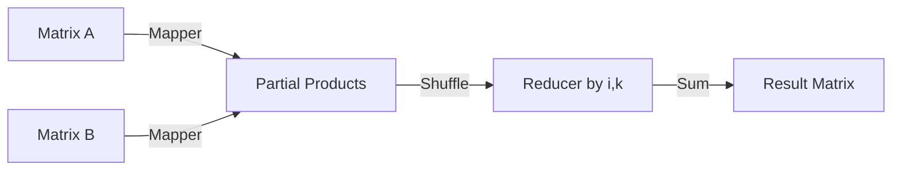

---

## Q2. PCY Algorithm (10 Marks)

**Recall Words:** *Pass1→Hash→Bitmap→Pass2→Apriori*
## Definition

**PCY (Park-Chen-Yu) Algorithm** finds frequent itemsets using hashing in pass 1 to reduce candidate pairs. Uses a hash table to count bucket frequencies.
### Steps:
1. **Pass 1:** Count item frequencies. Hash pairs into buckets.
2. **Bitmap:** Mark bucket as 1 if its count ≥ support threshold.
3. **Pass 2:** Only count pairs whose hash bucket = 1.

### Example:
**Transactions:**  
T1: {a,b,c}, T2: {a,b,d}, T3: {a,c,d}, T4: {b,c,d}, T5: {a,b,c}  
**Support = 3**

**Hash function:** h(i,j) = (i* j) mod 8

| Pair | Hash | Support |
|------|------|---------|
| (a,b) | 2 | 3 ✅ |
| (a,c) | 4 | 3 ✅ |
| (a,d) | 3 | 2 ❌ |
| (b,c) | 6 | 3 ✅ |
| (b,d) | 6 | 2 ❌ |
| (c,d) | 5 | 2 ❌ |

**Frequent 2-itemsets:** {a,b}, {a,c}, {b,c}

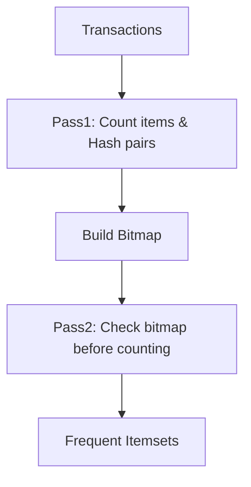

---

## Q3. DGIM Algorithm (10 Marks)

**Recall Words:** *Buckets → Sizes powers of 2 → Timestamps*

## Definition

**DGIM (Datar-Gionis-Indyk-Motwani)** estimates number of 1's in a sliding window of size N using $O(log^2N)$ bits, not $O(N)$. Uses exponentially increasing buckets.
### Rules:
- Bucket size = power of 2 (1,2,4,8...)
- At most 2 buckets of same size
- Each bucket has: timestamp (last 1's position) + size

### Example Stream (window size N=8):
**Stream:** 1 0 1 1 0 1 0 1 (oldest → newest)

| Step | Bit | Action | Buckets |
|------|-----|--------|---------|
| 1 | 1 | New bucket size1 | [1(t=8)] |
| 2 | 0 | Ignore | [1(t=8)] |
| 3 | 1 | New size1 | [1(t=8), 1(t=6)] |
| 4 | 1 | Merge 2 size1 → size2 | [2(t=7), 1(t=6)] |
| 5 | 0 | Ignore | same |
| 6 | 1 | New size1 | [2(t=7), 1(t=6), 1(t=2)] → merge → [2(t=7), 2(t=3)] |
| 7 | 0 | Ignore | same |
| 8 | 1 | New size1 | [2(t=7), 2(t=3), 1(t=1)] |

**Estimate 1's =** sum bucket sizes = 2+2+1 = 5 (Actual = 5)

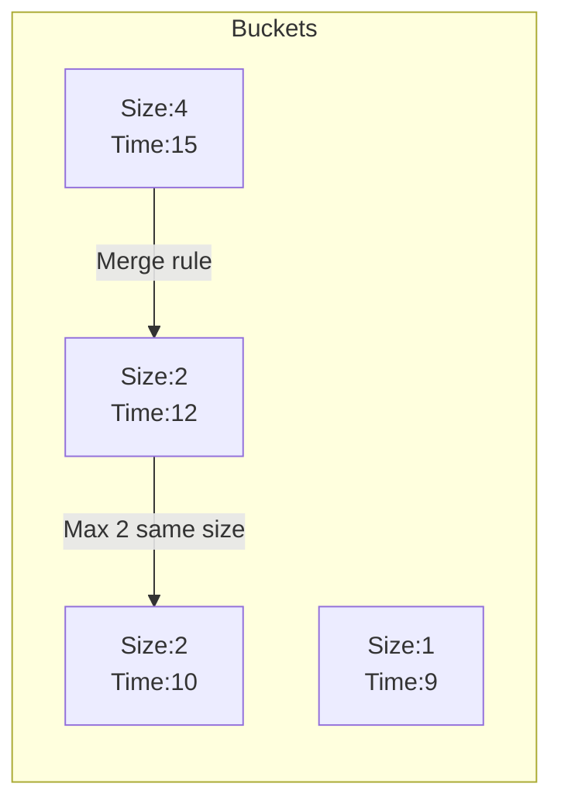

---

## Q4. CPM (Clique Percolation Method) (10 Marks)

**Recall Words:** *k-clique → adjacent → maximal clique → community*
## Definition

**CPM** finds overlapping communities in graphs using k-cliques. A k-clique community = union of all k-cliques reachable via adjacent (share k-1 nodes) cliques.
### Steps:
1. Find all maximal k-cliques (complete subgraphs of k nodes)
2. Build clique-clique overlap graph (edge if share k-1 nodes)
3. Connected components = communities

### Example Graph:
Nodes: 1-2-3-4-5 (triangle 1,2,3 and triangle 3,4,5 with k=3)

**Maximal 3-cliques:** C1={1,2,3}, C2={3,4,5}  
**Overlap:** share node 3 only → need k-1=2 nodes → No edge  
**Communities:** {1,2,3} and {3,4,5} separate

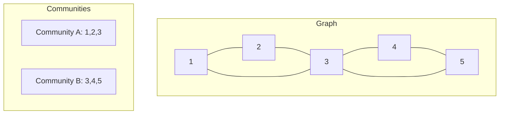

---

## Q5. HITS Algorithm (10 Marks)

**Recall Words:** *Hub → Authority → Mutual recursion*
## Definition

**HITS (Hyperlink-Induced Topic Search)** assigns two scores per page: **Hub** (links to good authorities) and **Authority** (linked by good hubs). Iterative mutual reinforcement.

### Formulas:
$$
a(p) = \sum_{q \to p} h(q) \quad \text{(Authority = sum of inlinking hubs)}
$$
$$
h(p) = \sum_{p \to r} a(r) \quad \text{(Hub = sum of outlinking authorities)}
$$

### Example Graph: 1→2, 1→3, 2→3, 3→1

Initial: a=[1,1,1], h=[1,1,1]

**Iteration 1:**
- a1 = h2+h3 = 1+1 = 2
- a2 = h1 = 1
- a3 = h1+h2 = 1+1 = 2
- h1 = a2+a3 = 1+2 = 3
- h2 = a3 = 2
- h3 = none = 0

Normalize (divide by max):

| Node | Authority | Hub |
|------|-----------|-----|
| 1 | 2/2=1.0 | 3/3=1.0 |
| 2 | 1/2=0.5 | 2/3=0.67 |
| 3 | 2/2=1.0 | 0 |

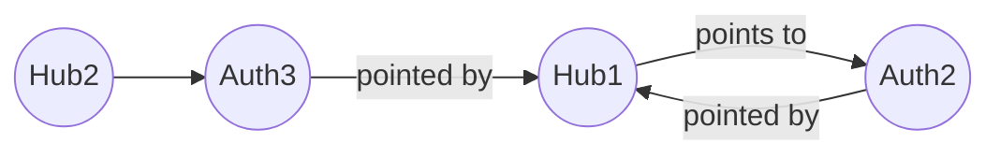

---

## Q6. Collaborative vs Content-Based Filtering (10 Marks)

**Recall Words:** *CF = "People like you" → CBF = "Items like this"*

| Aspect | Collaborative Filtering | Content-Based Filtering |
|--------|------------------------|------------------------|
| Data | User-item ratings | Item features |
| Example | "Users who bought X also bought Y" | "This movie has Brad Pitt → recommend another Brad Pitt movie" |
| Cold start | ❌ New item problem | ✅ Works with new items |
| Serendipity | ✅ Can find unexpected items | ❌ Similar only |
| Formula | Cosine similarity between users | TF-IDF on item features |

### Cosine Similarity:
$$
sim(u,v) = \frac{\sum_{i} r_{ui} \cdot r_{vi}}{\sqrt{\sum r_{ui}^2} \cdot \sqrt{\sum r_{vi}^2}}
$$

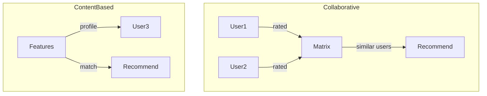

---

## Q7. Hadoop Ecosystem Architecture (10 Marks)

**Recall Words:** *HDFS + MapReduce + Hive + Pig + HBase*
## Definition

**Hadoop Ecosystem** = collection of open-source components for distributed storage (HDFS) and processing (MapReduce) plus auxiliary tools.

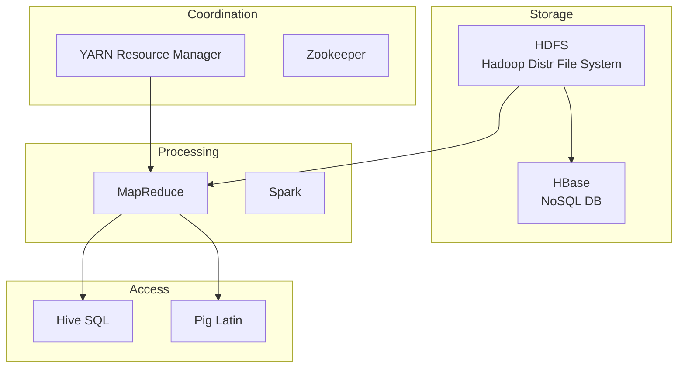

### 5 Components:

| Component | Function |
|-----------|----------|
| **HDFS** | Distributes data across nodes (NameNode + DataNodes) |
| **YARN** | Resource negotiator (schedules map/reduce tasks) |
| **MapReduce** | Parallel processing framework |
| **Hive** | SQL-like queries on big data |
| **HBase** | Column-family real-time access |

---

## Q8. Column Family & Graph Store NoSQL (10 Marks)

**Recall Words:** *CF = RowKey + ColumnKey + Timestamp | Graph = Nodes + Edges + Properties*

### Column Family Store (HBase, Cassandra):
**Example: User Profile**
```
RowKey: "user123"
  Family "Personal": {name:"Alice", age:30, timestamp:T1}
  Family "Orders": {order1:"$50", order2:"$25"}
```

### Graph Store (Neo4j):
**Example: Social Network**
```
(Node:Person {name:"Alice"}) -[:FRIEND]-> (Node:Person {name:"Bob"})
```

| Feature | Column Family | Graph Store |
|---------|--------------|-------------|
| Query | By row key | Traversal |
| Best for | Time-series, logs | Social, recommendations |
| CAP | AP (eventual consistency) | CP |

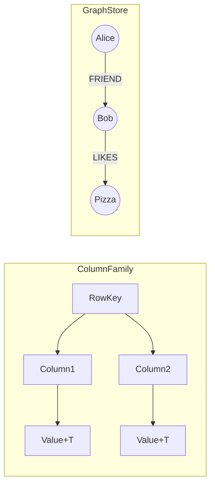

---

## Q9. CURE Algorithm (10 Marks)

**Recall Words:** *Representative points → Shrink toward centroid → Hierarchical*

### Steps:
1. Pick random sample
2. Cluster sample hierarchically
3. Pick **representative points** (scattered in cluster)
4. Shrink them toward centroid by factor α (0<α<1)
5. Assign remaining points to nearest cluster

### Advantages over K-means:
- Handles **non-spherical** shapes
- **Outlier** resistant
- Finds **arbitrary** shapes

### Example:
Cluster with points: (2,2), (3,3), (8,8), (9,9)  
Choose c=2 reps → picks (2,2) and (9,9)  
Shrink with α=0.5 → (5.5,5.5) and (5.5,5.5) same point → cluster merged

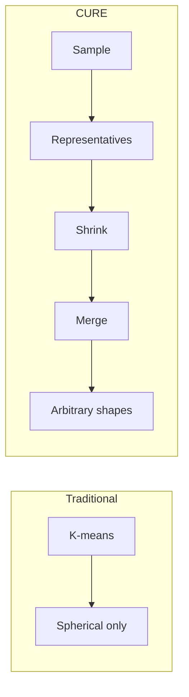

---

## Q10. Flajolet-Martin Algorithm (5-10 Marks)

**Recall Words:** *Hash → Trailing zeros → Max → Estimate = 2^(average)*

### Formula:
$$
E = 2^{\text{average of maximum trailing zeros across hash functions}}
$$

### Steps:
1. Choose k hash functions h1..hk (each → binary)
2. For each element x, compute hi(x) → count trailing zeros
3. Keep max trailing zeros for each hi
4. Estimate = 2^(average of maxes)

### Example:
Stream: 1,3,5,4,6,1,5,9,3,2  
h(x) = (2x+1) mod 16 (convert to binary)

| x | h(x) | Binary | Trailing zeros |
|---|------|--------|----------------|
| 1 | 3 | 0011 | 0 |
| 3 | 7 | 0111 | 0 |
| 5 | 11 | 1011 | 0 |
| 4 | 9 | 1001 | 0 |
| 6 | 13 | 1101 | 1 |
| 2 | 5 | 0101 | 0 |

**Max trailing zeros = 1**  
**Estimate = 2^1 = 2** (Actual distinct = {1,2,3,4,5,6,9} = 7 → underestimation, use multiple hash functions to average)

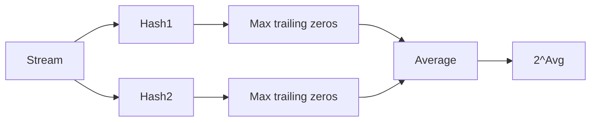

---

## Q11. MapReduce Grouping & Aggregation (10 Marks)

**Recall Words:** *Mapper: Group by key → Reducer: SUM/AVG/COUNT*

### Example: Sales data
Input: (City, Amount)  
Mumbai,100  
Delhi,200  
Mumbai,50  

**Mapper:**
- (Mumbai,100) → emit(Mumbai,100)
- (Delhi,200) → emit(Delhi,200)
- (Mumbai,50) → emit(Mumbai,50)

**Reducer - SUM:**
- Mumbai: 100+50 = 150
- Delhi: 200

**Output:** Mumbai 150, Delhi 200

### Pseudo-code:
```
map(key, record):
  city = record.city
  amount = record.amount
  emit(city, amount)

reduce(city, values[]):
  total = sum(values)
  emit(city, total)
```

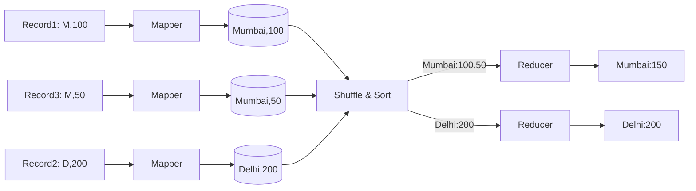

---

## Q12. Short Notes (5 marks each)

### A. Bloom Filter
**Recall Words:** *Bit array → k hashes → False positive possible, false negative impossible*

**Use:** Membership test in streaming data  
**Example:** Set {a,b,c}, bit array size 8, 2 hash functions  
- Add a: h1(a)=1, h2(a)=5 → set bits 1 and 5  
- Check d: h1(d)=3, h2(d)=6 → bits 0 → d not in set  

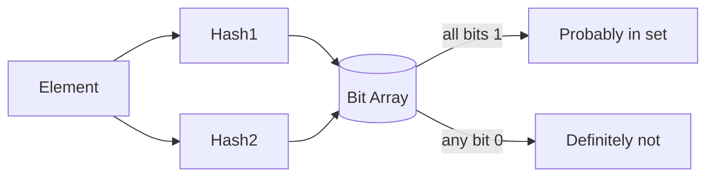

### B. CAP Theorem
**Recall Words:** *Consistency + Availability + Partition tolerance → Pick 2*

| Pick | Means | Example |
|------|-------|---------|
| CA | No partition allowed | RDBMS |
| CP | Wait for consistency | HBase |
| AP | Accept inconsistency | Cassandra |

### C. KNN Algorithm
**Formula:** Euclidean distance \( d = \sqrt{\sum(x_i - y_i)^2} \)  
**Steps:** Pick K nearest neighbors → Majority vote for class  
**Example:** K=3, neighbors: Cat, Cat, Dog → predict Cat

### D. Relational Algebra in MapReduce
- **Selection (σ)** → Mapper filter
- **Projection (π)** → Mapper pick columns
- **Join (⨝)** → Map on join key, reduce to merge

---

## ⏱️ 3-Hour Mock Exam Checklist

| Q# | Topic | Time | Done |
|----|-------|------|------|
| 1 | MapReduce MM | 12 min | ☐ |
| 2 | PCY | 12 min | ☐ |
| 3 | DGIM | 10 min | ☐ |
| 4 | CPM | 10 min | ☐ |
| 5 | HITS | 10 min | ☐ |
| 6 | CF vs CBF | 8 min | ☐ |
| 7 | Hadoop | 10 min | ☐ |
| 8 | NoSQL | 10 min | ☐ |
| 9 | CURE | 10 min | ☐ |
| 10 | FM | 8 min | ☐ |
| 11 | Grouping | 8 min | ☐ |
| 12 | Short notes | 12 min | ☐ |

**Total practice time: ~2 hours**

---

**Good luck with your Big Data Analytics exam! 📊**