---

### Question 1: Implementation Levels of Virtualization (10M)

**Answer:**

**1. Introduction**
Virtualisati3on is a technique that abstracts physical hardware resources to create multiple isolated, simulated environments. It is implemented at different layers of a computing stack, from the bare-metal hardware to high-level applications. Understanding these five implementation levels is crucial for designing efficient, scalable, and cost-effective cloud infrastructure.

**2. Key Implementation Levels**
The five levels, from lowest to highest abstraction, are:

*   **Instruction Set Architecture (ISA) Level:**
    *   **Mechanism:** Emulation. The entire hardware (CPU, memory, I/O) is simulated in software.
    *   **Example:** Bochs emulator, QEMU (without KVM).3
    *   **Characteristic:** Extremely slow due to full software translation but enables running software from one hardware architecture on another (e.g., ARM on x86).

*   **Hardware Abstraction Layer (HAL) / Hardware-Level Virtualization:**
    *   **Mechanism:** A **Hypervisor** (Virtual Machine Monitor - VMM) directly manages the physical hardware and creates independent Virtual Machines (VMs).
    *   **Examples:** VMware ESXi (bare-metal), Xen (bare-metal), KVM (kernel-based).
    *   **Characteristic:** High performance close to native, strong isolation. The hypervisor is either Type-1 (bare-metal) or Type-2 (hosted), though this level most purely represents Type-1.

*   **Operating System Level:**
    *   **Mechanism:** A single host OS kernel allows multiple isolated user-space instances, called **containers**.
    *   **Example:** Docker, LXC, Solaris Zones.
    *   **Characteristic:** Lightweight and fast, as there is no separate guest OS per instance. All containers share the host's kernel, making it less flexible than HAL (all must run the same OS family).

*   **Library (Programming Language) Level:**
    *   **Mechanism:** Instead of virtualizing the entire OS, only the OS's user-space APIs (libraries) are virtualized. A thin layer intercepts application calls to system libraries.
    *   **Example:** **WINE** (Wine Is Not an Emulator), which allows Windows applications to run on Linux by translating Windows API calls to POSIX calls.
    *   **Characteristic:** Very application-specific and does not require a full virtual machine or container.

*   **Application Level:**
    *   **Mechanism:** A runtime environment is virtualized specifically to execute a single application. It sits on top of a standard OS.
    *   **Example:** **Java Virtual Machine (JVM)** , .NET Common Language Runtime (CLR).
    *   **Characteristic:** Provides "write once, run anywhere" portability. The application interacts with the virtualized runtime, not the underlying OS directly.

**3. Architecture Diagram & Description**

**Mermaid.js Diagram (Hardware, OS, Library, Application):**
```mermaid
graph TD
    subgraph Virtualization_Stack
        direction TB
        
        subgraph Level_5_Application
            A["Application (e.g., Java App)"] --> JVM[Java Virtual Machine]
            JVM --> OS_5[Host Operating System]
        end

        subgraph Level_4_Library
            B["Application (e.g., MS Office)"] --> WINE[WINE Library Emulator]
            WINE --> OS_4[Host Operating System]
        end

        subgraph Level_3_OS_Level
            C1[Container 1] & C2[Container 2] --> Engine["Container Engine (Docker)"]
            Engine --> OS_3[Single Host OS Kernel]
            OS_3 --> HW_3[Physical Hardware]
        end

        subgraph Level_2_Hardware
            VM1["VM 1 (Guest OS)"] & VM2["VM 2 (Guest OS)"] --> Hypervisor[Hypervisor / VMM]
            Hypervisor --> HW_2[Physical Hardware]
        end
        
        subgraph Level_1_ISA
            App_ISA[Application] --> GuestOS_ISA[Guest OS] --> Emulator[Software Emulator]
            Emulator --> HW_1[Host OS & Physical Hardware]
        end
    end
    style Level_3_OS_Level fill:#f9f,stroke:#333
    style Level_2_Hardware fill:#ccf,stroke:#333
```
zz
**Text Description for Manual Sketch:**
Draw 5 horizontal layers, each representing a level.
1.  **Top Layer (ISA):** Draw a box for "App", inside a box for "Guest OS", inside a large box labeled "Software Emulator," all sitting on "Host Hardware." Annotate: "Full HW Simulation."
2.  **Second Layer (HAL):** Draw two boxes ("VM1", "VM2"), each containing a "Guest OS." They sit on a central block labeled "Hypervisor (VMM)." This block sits directly on "Physical Hardware." Annotate: "Direct HW Access."
3.  **Third Layer (OS):** Draw multiple boxes ("Container 1", "Container 2") all sitting on a shared "Container Engine" layer, which sits on a single "Host OS Kernel" on "Physical Hardware." Annotate: "Shared Kernel."
4.  **Fourth Layer (Library):** Draw an "App" box on top of a "WINE" interface block on top of "Host OS." Annotate: "API Translation."
5.  **Bottom Layer (Application):** Draw an "App" on top of a "JVM/CLR" runtime block on top of "Host OS." Annotate: "Managed Runtime."

**4. Conclusion**
The choice of virtualization level involves a trade-off between isolation, performance overhead, and flexibility. Hardware-level virtualization dominates cloud IaaS for its strong isolation, while OS-level virtualization (containers) is the backbone of modern PaaS and microservices due to its speed and density. Application-level virtualization provides unparalleled platform-independent portability.

---

### Question 2: Xen Architecture vs. KVM Architecture (10M)

**Answer:**

**1. Introduction**
**Xen** and **KVM (Kernel-based Virtual Machine)** are two dominant open-source, Type-1 hypervisor technologies powering major public clouds (e.g., AWS uses a modified Xen/KVM). While both enable hardware-level virtualization, their architectural philosophies differ fundamentally: Xen has a micro-kernel approach with a privileged control domain, while KVM extends a standard Linux kernel into a hypervisor.

**2. Xen Architecture**
*   **Concept:** A thin, bare-metal hypervisor is installed directly on hardware. It is the first software to boot, and it manages CPU, memory, and interrupts for all VMs.
*   **Core Component - Domain 0 (Dom0):** A special, privileged VM that starts automatically. It is the management interface for the entire system. It contains the native device drivers for physical hardware and provides a control interface to manage other "Guest Domains" (DomU).
*   **Guest Domain (DomU):** Unprivileged VMs that run user applications. They access physical hardware indirectly through Dom0 via a split-driver model (front-end driver in DomU, back-end driver in Dom0).
*   **Virtualization Modes:** Xen primarily supports **Paravirtualization (PV)** , where the guest OS kernel is modified to know it's virtualized for optimal performance, and **Hardware Virtual Machine (HVM)** , which requires CPU virtualization extensions (Intel VT-x/AMD-V) to run unmodified OSes.

**3. KVM Architecture**
*   **Concept:** KVM is a loadable Linux kernel module (`kvm.ko`) that transforms the Linux kernel itself into a bare-metal hypervisor. There is no separate thin hypervisor layer.
*   **Core Component - /dev/kvm:** Once the module is loaded, the kernel exposes a character device `/dev/kvm`. A user-space process (like QEMU) uses this device to create and run a VM. Each VM is simply a standard Linux process on the host.
*   **Hardware Emulation (QEMU):** KVM only virtualizes CPU and memory. It relies on a slightly modified version of QEMU for I/O device emulation (disk, network, etc.). This split design leverages the battle-tested hardware support of QEMU.
*   **Component Integration:** The host Linux kernel acts as the Dom0-equivalent, managing hardware drivers and scheduling CPU time between VMs (which are just processes) and other host tasks.

**4. Comparative Architecture Diagram**

**Mermaid.js Diagram (Xen vs KVM):**
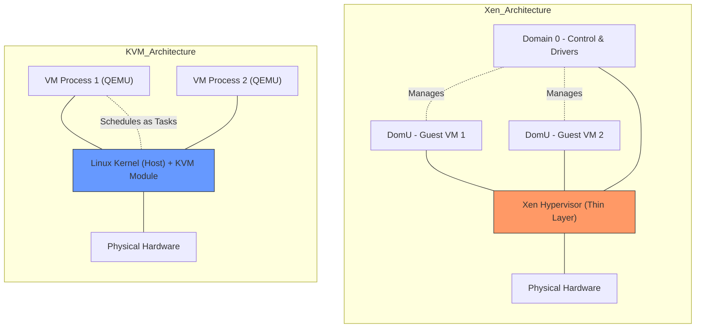

**Text Description for Manual Sketch:**
Draw two separate vertical stacks side-by-side.
*   **Left Stack (Xen):**
    1.  Bottom box: "Physical Hardware."
    2.  Above it, a thin box spanning the width: "Xen Hypervisor (Thin Microkernel)."
    3.  Above that, two parallel types of boxes: One large box labeled "Domain 0 (Privileged - Drivers, API)" and smaller boxes labeled "DomU (Guest VM)." Draw a dashed line from Dom0 to DomU labeled "Management API."
*   **Right Stack (KVM):**
    1.  Bottom box: "Physical Hardware."
    2.  Above it, a single large box: "Standard Linux Kernel + kvm.ko (Host)." Write inside "Scheduler, Drivers, VM Management."
    3.  Above the kernel, multiple parallel boxes: "VM 1 (QEMU Process)" and "VM 2 (QEMU Process)." Draw a note: "VMs are user-space processes."

**5. Comparison Table**

| Feature | Xen Architecture | KVM Architecture |
| :--- | :--- | :--- |
| **Hypervisor Type** | Native/Bare-metal (Type-1) with a micro-kernel design. | "Kernel-based" Hybrid. Turns a standard Linux kernel into a Type-1 hypervisor. |
| **Management Core** | **Domain 0 (Dom0)** : A special, always-on VM. | **Host Linux Kernel** : The native OS itself is the control domain. |
| **Driver Model** | Drivers reside exclusively in Dom0; DomUs use split-drivers. | Drivers reside in the host Linux kernel; used directly by KVM and QEMU. |
| **Guest VM Abstraction** | A Guest Domain (DomU) is a first-class entity in the hypervisor. | A VM is simply a **standard Linux process** (e.g., QEMU). |
| **Complexity** | Higher initial setup complexity; a dedicated control OS (Dom0) is required. | Simpler integration for Linux-centric environments; leverages all existing Linux tools. |

**6. Conclusion**
Xen's architecture prioritizes separation and a minimal trusted computing base with its dedicated thin hypervisor and isolated Dom0. KVM, conversely, prioritizes integration and simplicity, elegantly turning a robust, general-purpose Linux kernel into a competitive hypervisor. KVM's process-based VM model is a key reason for its mainstream adoption in cloud environments like Google Cloud and OpenStack.

---

### Question 3: AWS EC2 - Instance Types, Lifecycle & ENIs (10M)

**Answer:**

**1. Introduction**
**Amazon Elastic Compute Cloud (EC2)** is the fundamental IaaS building block of AWS, providing resizable, secure compute capacity in the cloud. It allows users to rent virtual machines (instances) on which they can deploy applications. Understanding the diverse instance families, the complete lifecycle of an instance, and its networking component (ENI) is critical for designing scalable and highly available architectures in the cloud.

**2. EC2 Instance Types (Families)**
AWS offers purpose-built instance types optimized for different use cases. The naming convention (e.g., `m5.large`) indicates the family, generation, and size.

*   **General Purpose (M, T families):**
    *   **Characteristic:** Balanced CPU, memory, and networking resources.
    *   **Use Case:** Web servers, application servers, small/mid-size databases. T-family instances are "burstable," providing a baseline CPU performance with the ability to burst.
*   **Compute Optimized (C family):**
    *   **Characteristic:** High performance-to-cost ratio for compute-intensive tasks. Features powerful processors.
    *   **Use Case:** Batch processing, high-performance web servers, scientific modeling, gaming servers, video encoding.
*   **Memory Optimized (R, X, High Memory families):**
    *   **Characteristic:** Delivers large amounts of RAM to support in-memory databases and processing of large datasets.
    *   **Use Case:** SAP HANA, Apache Spark, in-memory caches (Redis, Memcached), real-time big data analytics.
*   **Storage Optimized (I, D families):**
    *   **Characteristic:** High sequential read/write access to very large datasets on local, NVMe-based SSD instance storage.
    *   **Use Case:** Data warehousing (Redshift), Hadoop distributed file systems, transactional databases with high IOPS.
*   **Accelerated Computing (P, G, F families):**
    *   **Characteristic:** Use hardware accelerators (GPUs, FPGAs) for massive parallelism.
    *   **Use Case:** Machine learning inference (G), deep learning training (P), genomic research, hardware acceleration (F).

**3. Instance Lifecycle**
An EC2 instance transitions through distinct states from creation to termination.

**Mermaid.js State Diagram:**
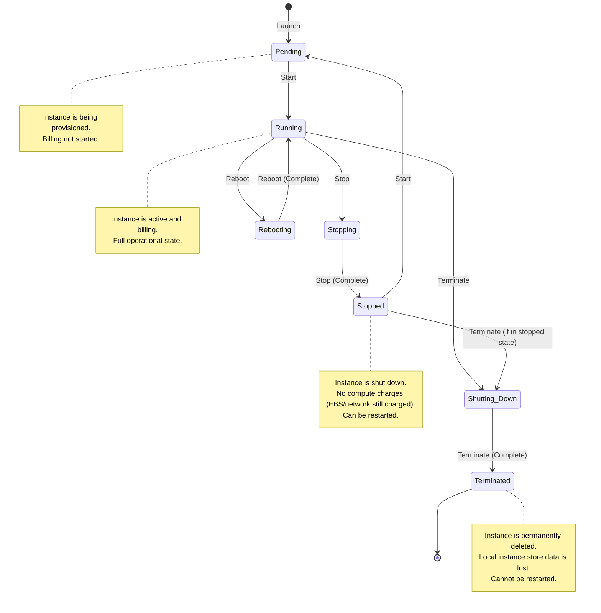

**Lifecycle State Description:**
1.  **Pending:** The instance is launching. AWS is allocating the virtual machine, assigning network interfaces, and copying the AMI. Billing has not started.
2.  **Running:** The instance is fully operational and billing per-second begins. It can be accessed and used for computation.
3.  **Stopping:** A graceful shutdown is initiated (e.g., OS shutdown scripts run). The instance moves to the 'stopped' state.
4.  **Stopped:** The VM is powered off. No charges for the compute resource itself, but associated resources like EBS volumes and Elastic IPs are still billed. The instance can be started again, returning it to 'Pending' and then 'Running', potentially on different physical hardware.
5.  **Shutting-Down:** The termination process has begun. Resources are being deallocated.
6.  **Terminated:** The instance is permanently destroyed. Its configuration and all data on instance-store volumes are lost. It cannot be recovered.

**4. Elastic Network Interfaces (ENIs)**
*   **Definition:** An ENI is a logical networking component in a VPC that represents a virtual network card. It acts as a point of attachment for an instance to a network.
*   **Attributes:** An ENI contains essential networking properties that follow it regardless of which instance it's attached to:
    *   **Primary Private IPv4 Address:** One primary IP from the subnet's range.
    *   **Secondary Private IPs:** One or more additional IPs.
    *   **One Elastic IP (EIPv4):** A public, static IP address that can be dynamically assigned to the ENI.
    *   **MAC Address:** A unique identifier for the interface.
    *   **Security Groups:** A set of inbound/outbound firewall rules.

**5. Use Case/Conclusion**
A common high-availability use case is failing over a service from one instance to another. An ENI with a known private IP and an associated Elastic IP is created. If the primary EC2 instance fails, the ENI is detached and re-attached to a standby instance. Traffic instantly redirects to the new, healthy instance with the same IP addresses, minimizing downtime without DNS propagation delays.

---

### Question 4: NIST Cloud Computing Architecture (5M - Q1 Staple)

**Answer:**

**1. Introduction**
The **National Institute of Standards and Technology (NIST)** defines a high-level, vendor-neutral reference architecture for cloud computing. It provides a conceptual model for all actors, activities, and functions within the cloud ecosystem, built upon five essential characteristics, three service models, and four deployment models.

**2. Core Components of the Reference Architecture**
The architecture identifies five major actors who interact in the cloud ecosystem.

*   **Cloud Consumer:**
    *   **Definition:** A person or organization that maintains a business relationship and uses services from Cloud Providers.
    *   **Activity:** Browses a service catalog, requests a service, sets up contracts, and consumes the service. (e.g., A student using AWS Lambda for a project).

*   **Cloud Provider:**
    *   **Definition:** The person, organization, or entity responsible for making a service available to interested parties.
    *   **Key Layers Managed by Provider:**
        1.  **Physical Layer:** The actual hardware (compute, network, storage).
        2.  **Resource Abstraction & Control Layer:** Virtualization hypervisors, software-defined networking, and storage management.
        3.  **Service Layer:** The interfaces customers interact with (SaaS app, PaaS platform, IaaS APIs).

*   **Cloud Auditor:**
    *   **Definition:** A party that can conduct independent assessments of cloud services, information system operations, performance, and security.
    *   **Role:** Ensures compliance with standards and regulations through security and privacy impact audits. (e.g., a PCI-DSS compliance auditor).

*   **Cloud Broker:**
    *   **Definition:** An entity that manages the use, performance, and delivery of cloud services, and negotiates relationships between Cloud Providers and Cloud Consumers.
    *   **Three Types of Services:**
        *   **Service Intermediation:** Enhancing a given service (e.g., identity management on top of IaaS).
        *   **Service Aggregation:** Combining multiple services into one (e.g., a dashboard managing multiple cloud providers).
        *   **Service Arbitrage:** Flexible, opportunistic brokerage (e.g., choosing the cheapest provider at a given moment).

*   **Cloud Carrier:**
    *   **Definition:** The intermediary that provides connectivity and transport of cloud services from Cloud Providers to Cloud Consumers.
    *   **Role:** The network and telecom providers (e.g., AT&T, Verizon). They provide access via phone, WAN, and internet. SLAs between provider and carrier are critical for end-to-end performance.

**3. Architecture Diagram**

**Mermaid.js Diagram:**
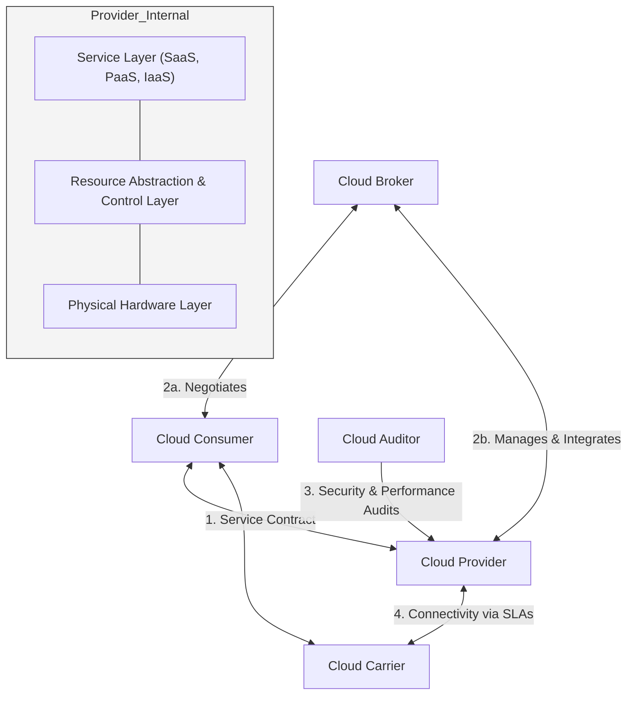

**Text Description for Manual Sketch:**
1.  Draw a central large box labeled "Cloud Provider." Inside it, draw three horizontal layers: "Service Layer (Top)," "Abstraction Layer (Middle)," "Physical Layer (Bottom)."
2.  Around it, draw and label four actors: "Cloud Consumer" (top-left), "Cloud Auditor" (top-right), "Cloud Broker" (bottom-right), "Cloud Carrier" (bottom).
3.  Draw double-headed arrows: Consumer <-> Provider (Label: "Service Contract"). Broker <-> Consumer & Provider (Label: "Integration"). Carrier <-> Provider & Consumer (Label: "Connectivity").
4.  Draw a single arrow from Auditor -> Provider (Label: "Compliance Audit").

**4. Conclusion**
The NIST reference architecture provides a standardized lexicon and conceptual framework, decoupling the roles of service creation, consumption, integration, delivery, and oversight. This clarity is essential for security planning, interoperability, and contractual relationships in complex cloud ecosystems.

---

### Question 5: Compare S3 vs EBS vs Glacier (10M)

**Answer:**

**1. Introduction**
AWS provides a portfolio of storage services designed for distinct use cases, varying in performance, cost, and access patterns. The three foundational services are **Amazon S3 (Simple Storage Service)** for object storage, **Amazon EBS (Elastic Block Store)** for block-level volumes, and **Amazon S3 Glacier** for archival storage. Choosing correctly requires understanding their fundamental differences in storage model, consistency, and retrieval times.

**2. Deep Dive into Services**

*   **Amazon S3 (Simple Storage Service)**
    *   **Storage Model:** **Object-based.** Data is stored as objects containing data, metadata, and a unique key, inside buckets.
    *   **Consistency Model:** Read-after-write consistency for PUTs of new objects, and eventual consistency for overwrite PUTs and DELETEs.
    *   **Accessibility:** Highly scalable, accessible by millions of concurrent connections via REST API over the internet or from within a VPC (via Gateway Endpoint). Not a file system; objects cannot be modified in place (they must be overwritten).

*   **Amazon EBS (Elastic Block Store)**
    *   **Storage Model:** **Block-based.** It provides raw, unformatted block-level storage volumes that can be attached to a *single* EC2 instance in its Availability Zone.
    *   **Consistency Model:** Immediate, strong read-after-write consistency. Acts just like a physical hard drive.
    *   **Accessibility:** Requires an EC2 instance. You format it with a file system (like NTFS, ext4) and use it for databases, file systems, or applications needing low-latency disk access.

*   **Amazon S3 Glacier**
    *   **Storage Model:** **Object-based, archival.** A storage class of S3, designed for data archiving and long-term backup.
    *   **Consistency Model:** Same as S3. The key differentiator is **retrieval time**, not the storage model itself.
    *   **Accessibility:** Accessed through the S3 console/API with lifecycle policies. Data is not instantly available. Retrieval options (Expedited, Standard, Bulk) range from minutes to hours.

**3. Comparison Table**

| Feature | Amazon S3 | Amazon EBS | Amazon S3 Glacier |
| :--- | :--- | :--- | :--- |
| **Storage Model** | Object Storage (Data + Metadata in Buckets) | Block Storage (Raw volumes for filesystems) | Archival Object Storage (S3 subclass) |
| **Access Interface** | Web APIs (REST/SOAP), Internet-accessible | Attached to a single EC2 instance over a network | Web APIs (REST) with Lifecycle Policies |
| **Use Case** | Static web hosting, data lakes, content distribution, backups. | Primary storage for a database (MySQL, Oracle), application hosting. | Long-term compliance archives, digital preservation, infrequently accessed data. |
| **Durability / Redundancy** | 99.999999999% (11 9's), replicated across multiple AZs within a region. | 99.999% durability, automatically replicated within its single AZ. Point-in-time snapshots in S3 for geo-redundancy. | Same 11 9's durability as S3. |
| **Performance** | High aggregate throughput; low latency for individual objects. | Very low, consistent latency (single-digit ms) for random I/O. High IOPS (Provisioned). | Low performance by design. Retrieval latency from 1-5 min (Expedited) to 5-12 hours (Bulk). |
| **Cost Model** | Pay for GB stored, requests, and data transfer. | Pay for provisioned capacity (GB and IOPS), whether used or not. | Extremely low storage cost, but charges for data retrieval. |

**4. Architecture Diagram (Use Case: 3-Tier Web App)**

**Mermaid.js Diagram:**
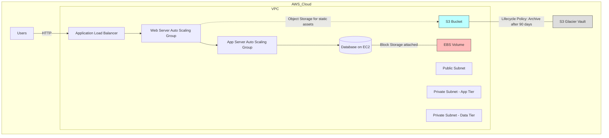

**Text Description for Manual Sketch:**
1.  Draw a VPC boundary. Inside, draw three tiers: Web, App, Data.
2.  In the Data tier, draw an EC2 instance labeled "DB Server." Draw a small cylinder directly attached to it with a bold line, label it "EBS Volume (Primary DB Data)." Annotate: "Low-latency, random I/O."
3.  Draw a path from the Web Tier to a separate cloud icon outside the VPC but in the "AWS Cloud," label it "S3 Bucket (Static Images, CSS)." Annotate: "Web-accessible object storage."
4.  From the S3 bucket, draw an arrow pointing to a vault icon, label it "Lifecycle Policy -> S3 Glacier Vault (Archived Logs)." Annotate: "Minutes-to-hours retrieval."

**5. Conclusion**
There is no "one size fits all" in cloud storage. The 3-tier architecture perfectly illustrates their synergy: **EBS** provides the high-performance transactional volume for a database, **S3** serves as a scalable, durable, and internet-accessible repository for static content, and **Glacier** provides ultra-low-cost, complaint archival of that S3 data, forming a complete data lifecycle management strategy.

---

Ready for the **Tier 2 questions** (Serverless, OpenStack, IAM, etc.)? Just say "Next."
### Question 6: Serverless Computing with AWS Lambda (10M)

**Answer:**

**1. Introduction**
**Serverless Computing** is a cloud-native execution model where the cloud provider dynamically manages the allocation and provisioning of servers. The term "serverless" is an abstraction; servers still exist, but the developer is completely insulated from server management, capacity planning, and OS maintenance. **AWS Lambda** is the pioneer and flagship serverless compute service that executes code in response to events, automatically scaling from zero to thousands of concurrent executions.

**2. Key Features of Serverless Computing**
*   **No Server Management:** No provisioning, patching, or monitoring of underlying VMs.
*   **Event-Driven Execution:** Code is invoked automatically by triggers from other AWS services or HTTP requests.
*   **Automatic Scaling:** Scales out seamlessly and automatically in response to incoming request volume. Can scale down to zero when idle.
*   **Sub-Second Billing:** Pay only for the compute time consumed (in milliseconds), not for idle capacity. No charge when code is not running.
*   **Stateless Nature:** Each invocation is independent and should be treated as stateless. Persistent state must be stored externally (e.g., DynamoDB, S3).

**3. AWS Lambda Core Components**

*   **Lambda Function:** The custom code (Node.js, Python, Java, Go, etc.) and its runtime configuration.
*   **Event Source (Trigger):** An AWS service or external application that invokes the Lambda function. Examples:
    *   **S3:** Object creation/deletion.
    *   **DynamoDB:** Table updates (streams).
    *   **API Gateway:** HTTP/REST API requests.
    *   **CloudWatch:** Scheduled events (cron jobs).
*   **Execution Role (IAM Role):** An IAM role that grants the Lambda function permissions to interact with other AWS services (e.g., read from an S3 bucket, write logs to CloudWatch).
*   **Runtime Environment:** The managed software environment in which the code runs, complete with necessary language SDKs.

**4. Architecture & Working Mechanism**

**Mermaid.js Workflow Diagram:**
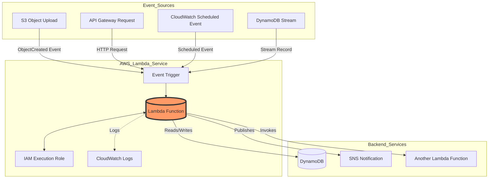

**Text Description for Manual Sketch:**
1.  **Left Side (Triggers):** Draw multiple small boxes stacked vertically: "S3 Event," "API Gateway," "CloudWatch Schedule," "DynamoDB Stream." Draw arrows from all of them converging towards the center.
2.  **Center (Lambda Core):** Draw a large circle/hexagon labeled "AWS Lambda Function." Inside it, write "Custom Code (Python/Node.js)" and "Runtime Env." Draw a small key icon attached to it labeled "IAM Execution Role."
3.  **Bottom/Right (Outputs):** Draw arrows from the Lambda function outward to other AWS service icons: "DynamoDB (Database)," "SNS (Notification)," "S3 (Results)." Draw a dashed arrow downwards to a "CloudWatch Logs" icon.
4.  **Annotations:** Above the Lambda circle, write "Stateless" and "Auto-Scales to Zero." This clearly shows the event-driven, loosely coupled nature.

**5. Comparison: Traditional vs. Serverless**

| Feature | Traditional EC2 Deployment | AWS Lambda (Serverless) |
| :--- | :--- | :--- |
| **Provisioning** | Manual selection of instance type, OS patching, scaling rules. | None. Fully managed execution environment. |
| **Scaling** | Auto-Scaling Groups based on metrics, with launch delays. | Instant, per-request, transparent scaling. |
| **Cost Model** | Pay for uptime (per-second/hour), regardless of utilization. | Pay-per-execution and duration (milliseconds). Zero cost when idle. |
| **Responsibility** | Shared Responsibility: Customer manages OS, app, security. | Provider handles OS, runtime, and scaling. Customer manages only code. |
| **Architecture** | Stateful by design; long-running processes. | Inherently stateless; suits event-driven, microservice patterns. |

**6. Real-World Use Case**
**Real-time Image Thumbnail Generation:**
A photographer uploads a high-resolution image to an **S3 bucket**. This `ObjectCreated` event instantly triggers a **Lambda function**. The function reads the image from S3, resizes it into multiple thumbnails, and writes them back to a different S3 bucket. There is no server to manage, and the processing power scales precisely with the number of uploaded images, with billing only for the milliseconds used per image.

---

### Question 7: OpenStack Architecture & Components (10M)

**Answer:**

**1. Introduction**
**OpenStack** is a free and open-source cloud operating system that controls large pools of compute, storage, and networking resources throughout a datacenter, all managed through a dashboard or via APIs. Its modular, component-based architecture is the standard open-source implementation of an IaaS platform, preventing vendor lock-in.

**2. Key Characteristics**
*   **Modular Design:** Composed of independent, interconnected projects.
*   **API-Driven:** All services communicate via well-defined REST APIs.
*   **Scalability:** Designed for horizontal scalability across thousands of nodes.

**3. Core Components (Core Services)**

The following are the non-negotiable components in a minimal OpenStack deployment:

*   **Horizon (Dashboard):**
    *   **Role:** Provides a web-based graphical user interface for administrators and users to provision and manage cloud resources. It communicates with the underlying APIs of all other services.
*   **Keystone (Identity Service):**
    *   **Role:** The central authentication and authorization service. It maintains a catalog of all other OpenStack services and their API endpoints. It issues tokens for user authentication.
*   **Neutron (Networking):**
    *   **Role:** Provides "Network as a Service." It manages virtual networks, subnets, routers, floating IPs, security groups, and load balancers. Users can create complex network topologies.
*   **Nova (Compute):**
    *   **Role:** The heart of the cloud. It manages the lifecycle of compute instances (VMs). It interacts with multiple hypervisors (KVM, Xen, VMware) via a driver-based architecture.
*   **Glance (Image Service):**
    *   **Role:** Manages virtual machine disk images. Nova uses Glance to retrieve images (e.g., Ubuntu 22.04, CentOS) when launching an instance. It can store images on various backends like Swift or local storage.
*   **Swift (Object Storage):**
    *   **Role:** A highly durable, scalable, and distributed object storage system, conceptually analogous to AWS S3. It stores unstructured data (images, logs, backups) across commodity servers.
*   **Cinder (Block Storage):**
    *   **Role:** Provides persistent block-level storage volumes for running Nova instances. These volumes can be detached and re-attached to other instances (analogous to AWS EBS).

**4. Logical Architecture Diagram**

**Mermaid.js Architecture Diagram:**
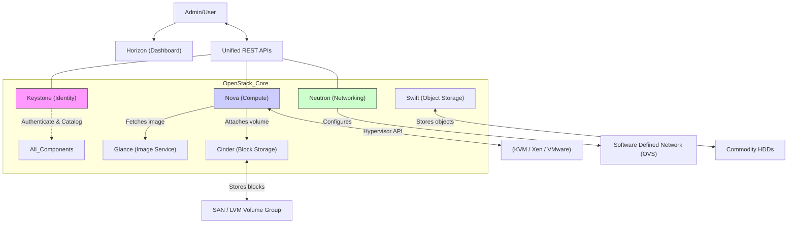

**Text Description for Manual Sketch:**
1.  **Top Row:** Draw a user and a dashboard icon (Horizon). Below them, write "REST API Layer."
2.  **Central Box (Core Services):** Draw a large dashed box labeled "OpenStack Core Services."
3.  **Inside the Box:**
    *   **Center:** Draw a circle for **Keystone** with arrows connecting it to every other component. Label it "Auth & Service Catalog."
    *   **Clockwise Placement:** Place **Nova** at the top, connected downwards to a hypervisor block (KVM/Xen). Place **Neutron** to the side, connected to an SDN switch icon. Place **Glance** and **Cinder** below Nova, showing arrows from Nova to them. Place **Swift** independently.
4.  **Physical Layer:** Below the box, draw icons for "Commodity Servers (HDDs)" connected to Swift, and "SAN Storage" connected to Cinder.

**5. Detailed Workflow for Launching a VM**
1.  **Authentication:** User authenticates with Keystone and receives a token.
2.  **Request:** User sends a request to Nova via API: "Launch an instance from this image, with this network, and attach this volume."
3.  **Verification:** Nova verifies the token with Keystone. It then contacts Glance to get image metadata, Neutron to assign a network port, and Cinder to check volume availability.
4.  **Scheduling:** Nova's scheduler finds an appropriate compute node. It sends the request to the `nova-compute` agent on that host.
5.  **Execution:** `nova-compute` fetches the actual image from Glance's storage, creates a virtual network interface via Neutron's agent, attaches the Cinder volume, and boots the VM using the hypervisor (KVM).

**6. Conclusion**
OpenStack’s modular, API-driven architecture allows enterprises and telecom providers to build massive, scalable, and open-source private clouds. The clear separation of concerns between Nova (compute), Neutron (networking), and Keystone (identity) provides architectural flexibility, preventing the vendor lock-in associated with proprietary public clouds.

---

### Question 8: IAM - Architecture, Standards, & Challenges (10M)

**Answer:**

**1. Introduction**
**Identity and Access Management (IAM)** in cloud computing is the security discipline that ensures the *right* individuals (identities) have the *right* access to the *right* resources for the *right* reasons. It is the critical first line of defense, moving from a perimeter-based security model to an identity-centric model in a zero-trust environment.

**2. Core IAM Architecture Components**
A robust cloud IAM architecture is built on four pillars:

*   **Identity Provider (IdP):**
    *   The trusted source that creates, manages, and stores digital identities. (e.g., Azure Active Directory, Okta, AWS IAM Identity Center). It handles user registration and authentication.
*   **Authentication:**
    *   Verifying "Who are you?" Mechanisms include:
    *   **Something you know:** Passwords, PINs.
    *   **Something you have:** Hardware tokens, a smartphone for TOTP (Time-based One-Time Password).
    *   **Something you are:** Biometrics (fingerprint, facial recognition).
    *   **Multi-Factor Authentication (MFA)** combines two or more of these factors.
*   **Authorization (Access Control):**
    *   Verifying "What are you allowed to do?" This is typically enforced via **policies**. A policy is a JSON document that defines:
        *   **Principal:** The user, group, or role.
        *   **Action:** The API call to allow/deny (e.g., `s3:GetObject`, `ec2:RunInstances`).
        *   **Resource:** The specific cloud resource (e.g., a specific S3 bucket ARN).
        *   **Effect:** `Allow` or `Deny`. An explicit deny always overrides an allow.
*   **Auditing & Reporting:**
    *   Logging all identity activities (authentication attempts, resource access) for compliance and threat detection. (e.g., AWS CloudTrail).

**3. Key Standards & Protocols**
Interoperability and secure federation rely on standards:

*   **SAML (Security Assertion Markup Language):**
    *   An XML-based open standard for exchanging authentication and authorization data between an IdP and a service provider. It is the backbone of most enterprise Single Sign-On (SSO) systems (e.g., logging into a SaaS app with corporate credentials).
*   **OAuth 2.0 (Open Authorization):**
    *   An authorization *framework* (not a protocol) that allows a third-party app to obtain limited access to a user's resources without exposing their password. It issues **access tokens** (e.g., a photo printing app getting permission to access your Google Photos but not your Gmail).
*   **OpenID Connect (OIDC):**
    *   A simple identity layer built on top of OAuth 2.0. It allows clients to verify the end-user's identity and obtain basic profile information via a standardized REST API. It issues an **ID Token** (JWT) in addition to an access token.

**4. IAM Workflow Diagram (Federated SSO)**

**Mermaid.js Sequence Diagram:**
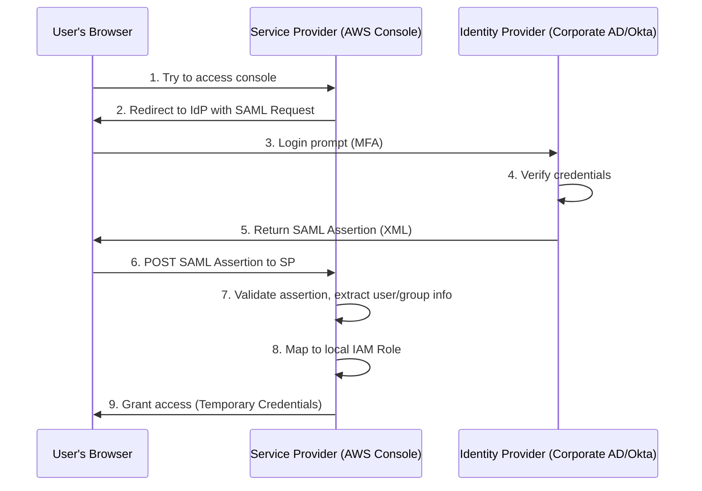
**Text Description for Manual Sketch:**
Draw three vertical boxes: "User Browser," "Service Provider (AWS)," "Identity Provider (Okta/AD)."
1.  Arrow from User to SP: "1. Access Request."
2.  Arrow back from SP to User: "2. Redirect to IdP (SAML Req)."
3.  Arrow from User to IdP: "3. Login + MFA."
4.  Arrow back from IdP to User: "4. SAML Assertion (Signed XML)."
5.  Arrow from User to SP: "5. POST Assertion."
6.  Inside SP: "6. Validate & Map to Role. 7. Grant Temp Credentials."

**5. Core IAM Challenges**
*   **Credential Theft (Phishing/MFA Bypass):** The primary attack vector remains obtaining valid user passwords, increasingly via sophisticated adversary-in-the-middle attacks that can steal session tokens even after MFA.
*   **Entitlement Creep & Over-Privileged Identities:** Over time, users accumulate access rights as they change roles without old permissions being revoked, leading to a massive blast radius if compromised. The principle of **Least Privilege** is hard to maintain at scale.
*   **Multi-Cloud Identity Sprawl:** Managing identities across AWS, Azure, and GCP with separate IAM systems creates fragmentation, inconsistent policies, and operational complexity.

**6. Conclusion**
Cloud IAM is not just a product but a continuous architectural process. As attacks evolve, the industry is shifting towards passwordless authentication (FIDO2 passkeys) and just-in-time access, where privileges are granted for a limited session on demand, significantly reducing the attack surface for credential-based threats.

---

### Question 9: Mobile Cloud Computing (MCC) (10M)

**Answer:**

**1. Introduction**
**Mobile Cloud Computing (MCC)** is an infrastructure paradigm where both data storage and data processing happen outside the mobile device, inside the cloud. It brings the benefits of cloud computing's power and storage to the inherently resource-constrained environment of smartphones, IoT devices, and tablets, bridging the gap between limited mobile hardware and demanding applications.

**2. Why MCC is Essential (Motivations)**
Mobile devices face inherent limitations:
*   **Limited Battery Life:** Complex computation drains power rapidly.
*   **Limited Storage:** Cannot store terabytes of data locally.
*   **Limited Processing Power:** Cannot handle real-time AI inference or complex graphics rendering efficiently.

MCC overcomes these by using the mobile device as a rich, thin client, with the cloud acting as the powerful, always-available backend.

**3. Generic Architecture of MCC**
The architecture consists of three main layers:

*   **Mobile Device Layer:**
    *   The user interface. Thin or thick client apps that provide the presentation layer. They have a local execution environment for immediate, latency-sensitive tasks (e.g., rendering a UI button press) but offload heavy work.
*   **Network Connectivity Layer:**
    *   The critical wireless bridge. Includes mobile networks (4G/5G) and Wi-Fi. This layer introduces challenges like variable bandwidth, latency, and intermittent connections, making efficient network usage critical.
*   **Cloud Infrastructure Layer:**
    *   The backbone. A combination of IaaS, PaaS, and SaaS resources. This layer handles the heavy lifting:
        *   **Elastic Compute:** Auto-scaling web/application servers (EC2).
        *   **Database & Sync:** Fully managed NoSQL databases for syncing user state across devices (e.g., Amazon Cognito Sync, DynamoDB).
        *   **Object Storage:** Storing user-generated content (S3).

**4. Architecture Diagram**

**Mermaid.js Architecture Diagram:**
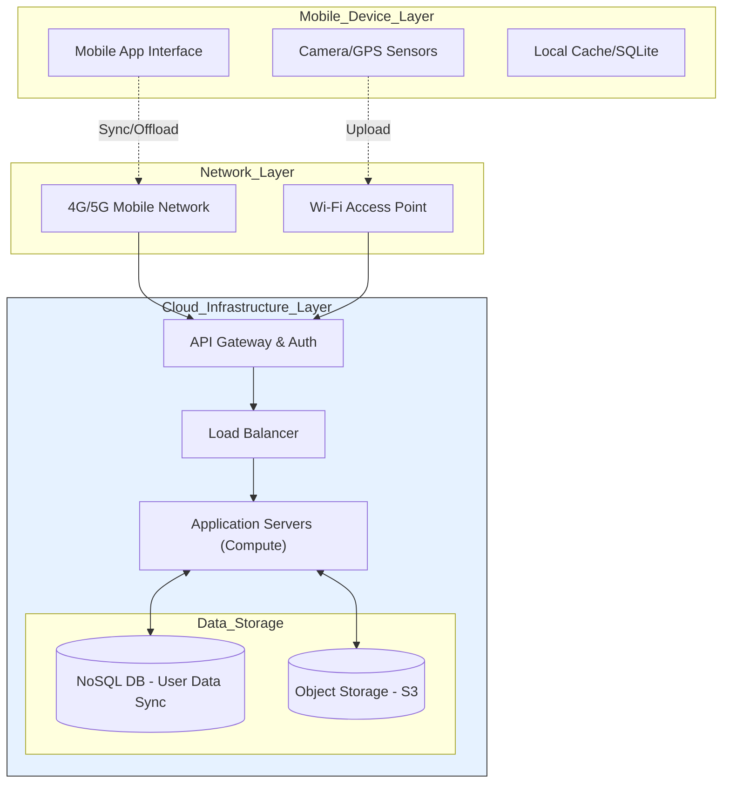

**Text Description for Manual Sketch:**
1.  **Left (Mobile):** Draw a smartphone. Inside, write "UI," "Local DB," and "GPS/Sensors." Annotate "Resource-Constrained Device."
2.  **Center (Network):** Draw two jagged lines representing "4G/5G" and "Wi-Fi" connecting the phone to the cloud. Label them "Latency, Bandwidth Variability."
3.  **Right (Cloud):** Draw a large cloud. Inside, draw three tiers:
    *   "API Gateway & Auth" at the entry.
    *   "App Servers (Auto-Scaling Group)" in the middle.
    *   "NoSQL DB" and "Object Storage" at the back.
    *   Arrows between them. Annotate the cloud: "Elastic Compute & Unlimited Storage."

**5. Key Benefits**
*   **Battery Life Extension:** By offloading intensive computations, device power consumption is significantly reduced.
*   **Data Syncing & Availability:** Users can switch seamlessly between devices; data is always up-to-date in the cloud.
*   **Cross-Platform Reach:** The core business logic in the cloud serves iOS, Android, and web clients, reducing development time.

**6. Core Challenges**
*   **Intermittent Connectivity:** Cloud access isn't always guaranteed (tunnels, remote areas). Apps must be designed for offline-first functionality with graceful synchronization.
*   **Latency & Jitter:** Real-time applications (AR/VR, autonomous driving) are highly sensitive to network delays. Edge computing is emerging as the solution, placing compute nodes (Cloudlets) closer to the user.
*   **Security & Privacy:** Sensitive user data traversing wireless networks requires strong encryption and careful identity management, especially regarding location data.

**7. Conclusion**
MCC is the symbiotic relationship that powers the modern app economy. While edge computing is now extending the cloud closer to the user to solve latency challenges, the fundamental concept of a powerful, centralized cloud backend doing the heavy lifting for a light, mobile frontend remains the dominant architectural pattern for mobile applications.

---

### Question 10: Virtualization vs. Traditional / Non-Virtualized Environment (10M)

**Answer:**

**1. Introduction**
The fundamental architectural shift that enabled cloud computing was moving from the **traditional "one server, one application" model** to a **virtualized environment**. In a traditional data center, a single OS kernel manages all physical hardware directly, leading to severe underutilization. Virtualization inserts a **hypervisor** abstraction layer to decouple the OS and applications from the hardware, enabling multi-tenancy and resource agility.

**2. Traditional (Non-Virtualized) Computing Environment**
*   **Architecture:** The operating system communicates directly with physical hardware components (CPU, RAM, Network Card) via drivers and BIOS/firmware. There is no intermediary.
*   **Resource Allocation:** Static and rigid. A single physical server typically runs a single OS instance and a single primary application stack.
*   **Key Issues:**
    *   **Server Sprawl & Underutilization:** CPU utilization often averages 5-15%.
    *   **High Cost:** High capital (server cost), operational (power, cooling), and management costs.
    *   **Application Conflict:** Running multiple apps on one OS risks DLL hell, memory leaks, and security vulnerabilities.
    *   **Low Agility:** Deploying a new service takes weeks for hardware procurement.

**3. Virtualized Computing Environment**
*   **Architecture:** A **Hypervisor (Virtual Machine Monitor)** is installed directly on the hardware (Type-1) or on an OS (Type-2). It sits between the hardware and the OS, carving physical resources into isolated Virtual Machines (VMs).
*   **Resource Allocation:** Abstracted and dynamic. The hypervisor manages a shared pool of CPU, memory, and I/O, allocating it to VMs as needed. Each VM gets a virtualized view of the hardware.
*   **Key Advantages:**
    *   **Server Consolidation:** Run 10-20 VMs on one physical server, pushing utilization to 80%+.
    *   **Isolation:** A crash, security breach, or faulty driver in one VM does not affect another.
    *   **Agility & Mobility:** VMs are files. They can be provisioned in minutes, snapshotted, cloned, and live-migrated from one physical host to another without downtime.

**4. Comparison Table**

| Feature | Traditional (Bare-Metal) | Virtualized (Hypervisor-Based) |
| :--- | :--- | :--- |
| **Hardware Access** | Direct, exclusive OS access to hardware. | Mediated access by the hypervisor; VMs see virtual hardware. |
| **Performance** | 100% native performance for that single workload (no overhead). | Near-native (1-3% overhead) due to hypervisor CPU scheduling and memory translation. |
| **Resource Utilization** | Very low (5-15%), one workload per server. | Very high (80%+), multiple workloads consolidated on one server. |
| **Isolation & Security** | None. A single OS compromise compromises the entire server. | Strong isolation. A single VM compromise is contained within that VM's sandbox. |
| **Provisioning Speed** | Weeks to months (hardware order, rack, cable). | Minutes (template/clone a VM file). |
| **Hardware Independence** | Tied to specific physical hardware, drivers, and firmware. | VMs see a standardized, generic virtual hardware set (e.g., e1000 NIC). This enables seamless migration. |

**5. Architectural Diagram (Side-by-Side)**

**Mermaid.js Diagram:**
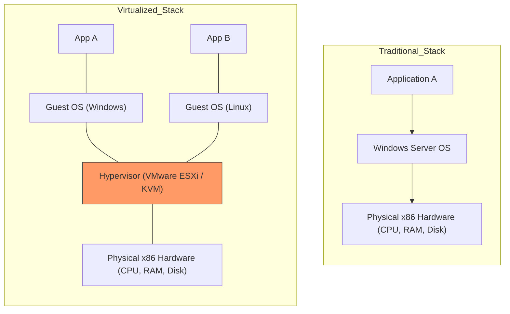

**Text Description for Manual Sketch:**
1.  **Left Stack (Traditional):** Draw a single vertical tower. Bottom box: "Physical Hardware (CPU, RAM)." Middle box: "Single OS (Windows)." Top box: "App A." Label the entire stack as "Direct Access, Underutilized."
2.  **Right Stack (Virtualized):** Draw a similar tower but with a split in the middle.
    *   Bottom box: "Physical Hardware."
    *   Next box: A thin layer spanning the width, labeled "Hypervisor (ESXi/KVM)." Shade it.
    *   Above the hypervisor, draw two parallel stacks. Each stack has a "Guest OS" box and an "App" box.
    *   Label the entire stack: "Mediated Access, Isolated VMs, High Utilization."

**6. Conclusion**
The virtualized environment is the foundational technology for modern IaaS clouds. It abstracted the software from the hardware, solving the inefficiency crisis of traditional data centers. While the industry is now complementing this with containerization (OS-level virtualization) for even denser workloads, hardware-level virtualization remains the gold standard for strong isolation and running diverse operating systems on the same physical infrastructure.

Proceeding with the **Tier 3: 60% Probability** questions and the **Wildcard Predictions**. These are your distinction-clinching topics that separate a good score from a top-tier one.

---

### Question 11: Everything as a Service (XaaS) & SPI Model (10M)

**Answer:**

**1. Introduction**
**Everything as a Service (XaaS)** is the ultimate end-state of the cloud service model evolution, where virtually any IT function, process, or infrastructure component can be delivered as a consumable, subscription-based service over the internet. It is the logical extension of the foundational **SPI Model (SaaS, PaaS, IaaS)** , which defined the three core pillars of cloud service delivery. XaaS represents the proliferation of specialized services beyond these original three.

**2. The Foundational SPI Model (Recap)**
Before understanding XaaS, one must master the SPI stack, which represents increasing levels of abstraction and decreasing levels of user control.

| Model | What the Provider Manages | What the Consumer Manages | Analogy |
| :--- | :--- | :--- | :--- |
| **IaaS (Infrastructure)** | Virtualization, servers, storage, networking. | OS, middleware, runtime, data, applications. | Pizza "Take & Bake": You get the raw ingredients, but you need an oven and skills. |
| **PaaS (Platform)** | IaaS + OS, runtime, middleware. | Data and application code. | Pizza Delivery: It's cooked and delivered; you just eat it (run your app). |
| **SaaS (Software)** | Everything. The entire application stack. | Nothing but user configuration. | Dining Out: The restaurant handles everything; you just consume the meal. |

**3. Mermaid.js Diagram: The XaaS Spectrum**
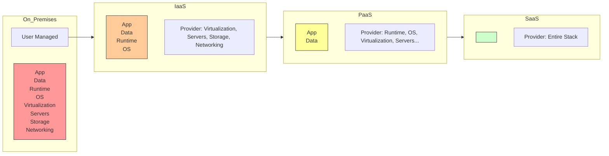

**4. The XaaS Universe: Specialized Services**
XaaS is the ecosystem of niche services built on top of or parallel to the SPI model.

*   **DBaaS (Database as a Service):**
    *   A specialized form of PaaS. The provider manages database installation, patching, backups, and high availability. The consumer only manages the schema and data.
    *   **Examples:** Amazon RDS, Azure SQL Database, Google Cloud Spanner.
*   **STaaS (Storage as a Service):**
    *   An IaaS-adjacent model. Provisioning storage on demand, paying for capacity used.
    *   **Examples:** Amazon S3 (Object), Amazon EFS (File), Google Cloud Storage.
*   **DRaaS (Disaster Recovery as a Service):**
    *   Replicating and hosting physical or virtual servers in the cloud to provide failover in the event of a disaster.
    *   **Mechanism:** Continuous block-level replication from on-premises to a cloud target. In a disaster, cloud VMs are spun up from the replicated data.
    *   **Examples:** AWS Elastic Disaster Recovery, Azure Site Recovery.
*   **CaaS (Containers as a Service):**
    *   An abstraction layer between IaaS and PaaS, providing a managed environment to deploy and manage containerized applications using orchestration.
    *   **Examples:** Amazon EKS (Kubernetes), Google Kubernetes Engine (GKE).
*   **SECaaS (Security as a Service):**
    *   Delivering security capabilities like identity management, threat detection, and DDoS protection via a subscription model.
    *   **Examples:** Cloudflare WAF, Okta Identity Cloud.

**5. Comprehensive XaaS Architecture Diagram**

**Mermaid.js Diagram:**
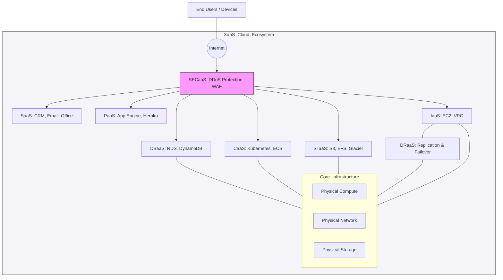

**Text Description for Manual Sketch:**
1.  Draw a large cloud boundary labeled "XaaS Ecosystem."
2.  At the entry point, draw a security shield labeled "SECaaS (DDoS, Identity)." All traffic flows through this shield.
3.  Behind the shield, draw multiple service blocks. Place the foundational "IaaS" block at the bottom. Stack "CaaS," "DBaaS," and "PaaS" above it. Place "SaaS" and "STaaS" to the sides.
4.  Draw a separate block "DRaaS" with a dashed line connecting it to IaaS, labeled "Continuous Replication."
5.  Draw "Physical Infrastructure" at the very bottom, supporting everything. Annotate: "Each X is a specialized, self-service, metered service."

**6. Conclusion**
The shift to XaaS is a shift from CapEx-heavy, rigid infrastructure to an OpEx-driven, agile ecosystem of composable services. The SPI model gave us the vocabulary, but XaaS gave us the combinatorial power to build a cloud-native enterprise.

---

### Question 12: Virtual Private Cloud (VPC) & Security Components (10M)

**Answer:**

**1. Introduction**
A **Virtual Private Cloud (VPC)** is a logically isolated, private section of a public cloud where you can launch resources in a virtual network that you define. It is the fundamental networking layer for your cloud resources, providing complete control over IP addressing, subnets, route tables, and network gateways, while integrating deep security controls like Security Groups.

**2. Core VPC Components**

*   **VPC (The Container):**
    *   A virtual network dedicated to your account within a single region. You define a private IP address range using CIDR notation (e.g., `10.0.0.0/16`). It spans all Availability Zones (AZs) in the region.

*   **Subnets:**
    *   A segment of the VPC's CIDR range within a single Availability Zone. Resources (EC2, RDS) are launched inside subnets.
    *   **Public Subnet:** Has a route to an Internet Gateway. Resources can be accessed from the internet if they have a public IP.
    *   **Private Subnet:** No route to an Internet Gateway. Resources cannot be directly accessed from the internet; they use a NAT Gateway in a public subnet for outbound access.

*   **Route Tables:**
    *   A set of rules, called routes, that determine where network traffic is directed. Each subnet must be associated with a route table. A route table controls traffic leaving the subnet.

*   **Internet Gateway (IGW):**
    *   A horizontally scaled, redundant, and highly available VPC component that allows communication between your VPC and the internet. One VPC can have only one IGW.

*   **NAT Gateway:**
    *   A managed Network Address Translation service residing in a public subnet. It enables instances in a private subnet to connect to the internet (for updates, patches) but prevents the internet from initiating connections with those instances.

**3. VPC Security Layer**

*   **Security Groups (SG):**
    *   **Level:** Instance-level, stateful virtual firewall.
    *   **Function:** Controls inbound and outbound traffic for an Elastic Network Interface (ENI). It operates based on **allow rules only**. You specify port, protocol, and source/destination.
    *   **Stateful Nature:** If you allow inbound traffic from a specific IP on port 80, the return traffic is automatically allowed, regardless of outbound rules.

*   **Network Access Control Lists (NACL):**
    *   **Level:** Subnet-level, stateless firewall.
    *   **Function:** An optional layer of security that controls traffic entering and exiting one or more subnets. It uses **both allow and deny rules** evaluated in numerical order.
    *   **Stateless Nature:** Return traffic must be explicitly allowed by rules. You need to open ephemeral ports for outbound return traffic.

**4. VPC Architecture Diagram (Multi-Tier Web App)**

**Mermaid.js Diagram:**
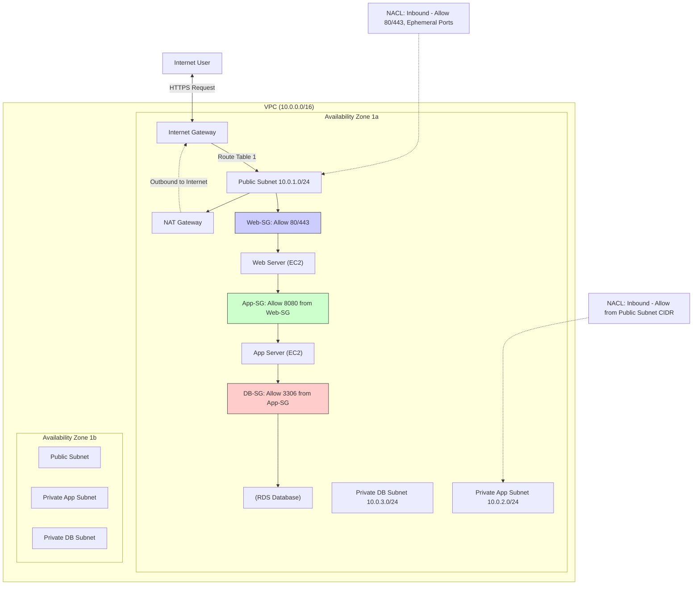

**Text Description for Manual Sketch:**
1.  Draw a large boundary box labeled "VPC: 10.0.0.0/16."
2.  Draw a cloud-internet icon on the left, connected to an "Internet Gateway (IGW)" icon just inside the VPC boundary.
3.  Inside the VPC, draw three rows of boxes representing three subnets in an AZ.
    *   **Row 1 (Public):** Box containing "Web Server." Draw a small lock icon attached to it labeled "Web-SG: Allow 80/443." Draw a route table icon with a rule "0.0.0.0/0 -> IGW" connected to this subnet.
    *   **Row 2 (Private App):** Box containing "App Server." Lock labeled "App-SG: Allow 8080 from Web-SG." Route table has "0.0.0.0/0 -> NAT Gateway."
    *   **Row 3 (Private DB):** Box containing "RDS DB." Lock labeled "DB-SG: Allow 3306 from App-SG."
4.  Draw a "NAT Gateway" inside the public subnet, with a dashed arrow to the IGW.
5.  Draw dashed lines wrapping around the subnets labeled "NACL (Stateless Subnet Firewall)."

**5. Key Comparison: SG vs NACL**

| Feature | Security Group | Network ACL |
| :--- | :--- | :--- |
| **Scope** | Instance-level (attached to ENI). | Subnet-level (applies to all instances in subnet). |
| **State** | **Stateful:** Return traffic is automatically allowed. | **Stateless:** Return traffic must be explicitly allowed by rules. |
| **Rules** | Allow rules only. | Both Allow and Deny rules. |
| **Evaluation** | All rules are evaluated together before a decision is made. | Rules are evaluated in numerical order (lowest to highest). |

**6. Conclusion**
A VPC is your personal, secured slice of the cloud. The combination of public/private subnets and the layered defense of stateless NACLs at the subnet border with stateful Security Groups at the instance level provides a defense-in-depth security model. This architecture is the blueprint for virtually every secure, production-grade enterprise deployment in a public cloud.

---

### Question 13: Privacy Concerns in Cloud - Legal & Regulatory (10M)

**Answer:**

**1. Introduction**
Cloud privacy transcends mere data confidentiality; it is a complex interplay of technology, law, and geopolitics. As organizations migrate data to the cloud, they lose direct physical control, creating a "black box" problem. Privacy concerns are primarily driven by **data residency** (where data is stored at rest) and the jurisdictional conflict of laws between a cloud provider's country and the data owner's country.

**2. Core Privacy Concept: Data Residency & Sovereignty**
*   **Data Residency:** The physical or geographical location where an organization's data is stored. Cloud providers use "regions" to enforce this. (e.g., an EU-based company chooses the `eu-west-1` region in Ireland).
*   **Data Sovereignty:** The legal concept that data is subject to the laws of the nation where it is physically located. This is the root cause of most legal conflicts. A U.S. court can issue a warrant for data stored on a server in the U.S., even if the owner is a European company.

**3. Key Regulatory Frameworks**
Two major regulations define the global privacy landscape:

*   **GDPR (General Data Protection Regulation):**
    *   **Scope:** Applies to any organization processing the personal data of individuals in the **European Union**, regardless of the organization's location.
    *   **Key Principles:**
        *   **Consent:** Unambiguous, specific, and freely given consent for data processing.
        *   **Right to Erasure ("Right to be Forgotten"):** Individuals can request deletion of their data.
        *   **Data Portability:** Right to receive personal data in a machine-readable format.
        *   **Breach Notification:** Mandatory notification to the supervisory authority within 72 hours.
        *   **Data Protection Officer (DPO):** Mandatory appointment for certain organizations.
    *   **Penalties:** Fines of up to €20 million or 4% of global annual turnover, whichever is greater.

*   **IT Act (India) & DPDP Act 2023:**
    *   The Digital Personal Data Protection Act, 2023, is India's modern privacy law.
    *   **Key Provisions:** Requires explicit consent for processing, mandates breach notification, and defines "Significant Data Fiduciary" responsibilities.
    *   **Data Transfer:** Allows cross-border data transfer except to countries specifically restricted by the government, a significant shift from the previous data localization mandate. This is critical for cloud architecture choices in India.

**4. Mermaid.js Diagram: The Cross-Border Privacy Conflict**
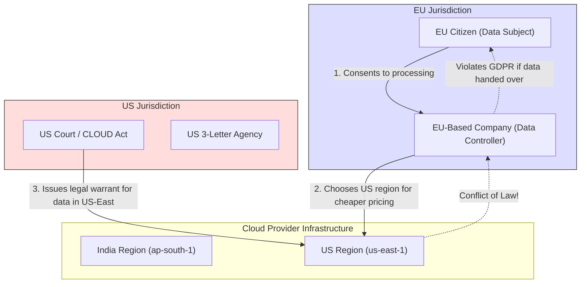

**Text Description for Manual Sketch:**
1.  Draw two large boxes side-by-side: "EU Jurisdiction" and "US Jurisdiction."
2.  In the EU box, draw a user (Data Subject) and a company (Data Controller). An arrow: "1. GDPR-Protected Data."
3.  In the US box, draw a courthouse/agency. An arrow from the court to a cloud data center in the middle labeled "Data Center (us-east-1)." Label the arrow: "3. CLOUD Act Warrant for Data."
4.  Draw a conflicted arrow from the Data Center back to the EU company labeled "Conflict of Law: Compliance with US law violates GDPR Art. 48."

**5. Regulatory Challenges for Cloud Providers & Consumers**
*   **Conflicting Legislation:** The US CLOUD Act compels US-based cloud providers (AWS, Azure, GCP) to provide data requested by US law enforcement, even if that data is stored in a foreign region. This directly conflicts with GDPR's restrictions on transferring personal data outside the EU without adequate protections.
*   **Shared Responsibility for Privacy:** While the cloud provider secures the *infrastructure*, the cloud consumer is legally the "Data Controller" and bears ultimate responsibility for ensuring compliance. This requires the consumer to implement technical measures like encryption (with customer-managed keys), access controls, and proper region selection.
*   **Vendor Lock-in & Data Portability:** GDPR mandates portability, but moving terabytes of data out of a specific cloud provider's object storage format is a non-trivial technical and financial challenge.

**6. Mitigation Strategies (A MU Topper's Response)**
*   **Geographically Restricted Architectures:** Architect deployments to keep sensitive data within a specific geographic boundary (e.g., EU-only regions).
*   **Hold Your Own Key (HYOK) & Confidential Computing:** Using encryption key management (AWS KMS, Azure Key Vault) where the cloud provider never has access to the keys. Confidential computing uses hardware-enforced TEEs (Trusted Execution Environments) to encrypt data *in use* (in memory), closing the last gap.
*   **Contractual Safeguards:** Insisting on Standard Contractual Clauses (SCCs) in the cloud provider agreement to legally guarantee adequate data protection.

**7. Conclusion**
Privacy in the cloud is not a checkbox; it is a continuous legal and architectural process. The tension between global cloud infrastructure and resurgent data sovereignty laws requires organizations to treat privacy as a primary design constraint, not an afterthought. The era of "Move fast and break things" has given way to "Design for privacy and data sovereignty from day one."

---

### Question 14: DynamoDB - Features & Comparison with RDS (5M)

**Answer:**

**1. Introduction**
**Amazon DynamoDB** is a fully managed, serverless, key-value and document NoSQL database designed for single-digit millisecond performance at any scale. In contrast, **Amazon RDS (Relational Database Service)** is a managed service for traditional relational databases (MySQL, PostgreSQL, Oracle). The choice between them is the classic architectural decision between a rigid, ACID-compliant schema and a flexible, high-velocity, schema-less database.

**2. Key Features of DynamoDB**
*   **Performance:** Consistent single-digit millisecond latency, regardless of table size.
*   **Scalability:** Serverless and automatically scales throughput capacity (reads/writes per second) up or down based on demand. No downtime during scaling.
*   **Data Model:** Supports both key-value and document (JSON) data models. Schema-less, meaning each item can have different attributes.
*   **DynamoDB Streams:** A time-ordered sequence of item-level changes (insert, update, delete) in a table. This is critical for event-driven architectures, enabling triggers for Lambda functions for cross-region replication.

**3. Comparison Table: DynamoDB vs. RDS**

| Feature | DynamoDB (NoSQL) | RDS (Relational/SQL) |
| :--- | :--- | :--- |
| **Data Model** | Schema-less (Key-Value/Document). Flexible attributes. | Strict, pre-defined schema with tables, rows, and columns. |
| **Query Language** | Proprietary API calls (`GetItem`, `Query`, `Scan`). No standard SQL. | Standard Structured Query Language (SQL) with joins. |
| **Consistency Model** | Eventually Consistent by default. Strongly consistent reads available optionally. | Strongly consistent (ACID transactions). |
| **Storage Scaling** | No size limits. Automatically distributes data across partitions. | Vertical scaling (bigger instance) or read replicas. Has a max storage limit per instance. |
| **Use Case** | High-traffic web apps, real-time bidding, gaming leaderboards, user profile stores, IoT data. | Traditional ERP, CRM, financial transaction ledgers requiring complex joins and ACID guarantees. |

**4. Decision Workflow Diagram (5M)**

**Mermaid.js Decision Flow:**
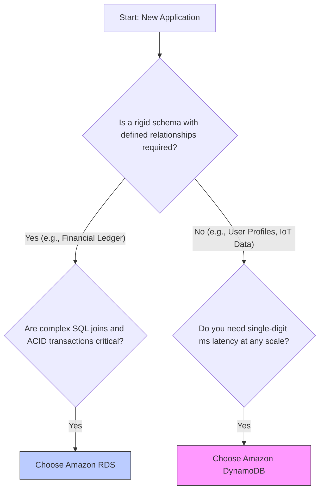

**5. Conclusion**
The choice isn't about "better," but about fit. RDS is for structured data with complex relationships and transactional integrity. DynamoDB is for high-velocity, unstructured/semi-structured data where latency and seamless scaling are paramount. Serverless applications frequently use **both**: DynamoDB for the high-scale operational data store and RDS Aurora for the analytics/business intelligence layer.

---

### Question 15: CloudWatch - Metrics, Alarms, and Use Cases (5M)

**Answer:**

**1. Introduction**
**Amazon CloudWatch** is the central monitoring and observability service for AWS resources and applications. It acts as the "nervous system" of a cloud deployment, collecting and tracking metrics, collecting and monitoring log files, and automatically reacting to changes in your AWS environment through alarms.

**2. Core Components**
*   **Metrics:**
    *   A time-ordered set of data points representing a measurable variable. AWS services send standard metrics to CloudWatch automatically (free tier applies).
    *   **Basic Monitoring:** Provides data in 5-minute intervals (default for EC2).
    *   **Detailed Monitoring:** Provides data in 1-minute intervals (chargeable).
    *   **Examples:** `CPUUtilization` of an EC2 instance, `NumberOfObjects` in an S3 bucket, `Billing` estimates, `5xxErrorRate` on an API Gateway.
    *   **Custom Metrics:** You can publish your own application-level metrics (e.g., memory usage, number of logged-in users) to CloudWatch via the API.

*   **Alarms:**
    *   A CloudWatch Alarm watches a single metric over a specified time period.
    *   It performs one or more specified actions based on the value of the metric relative to a threshold. Actions are automated.
    *   **Alarm States:**
        *   **OK:** The metric is within the defined threshold.
        *   **ALARM:** The metric is breaching the threshold.
        *   **INSUFFICIENT_DATA:** The alarm has just started, the metric is not available, or not enough data is available to determine the alarm state.

**3. Mermaid.js Diagram: Auto-Scaling Use Case**
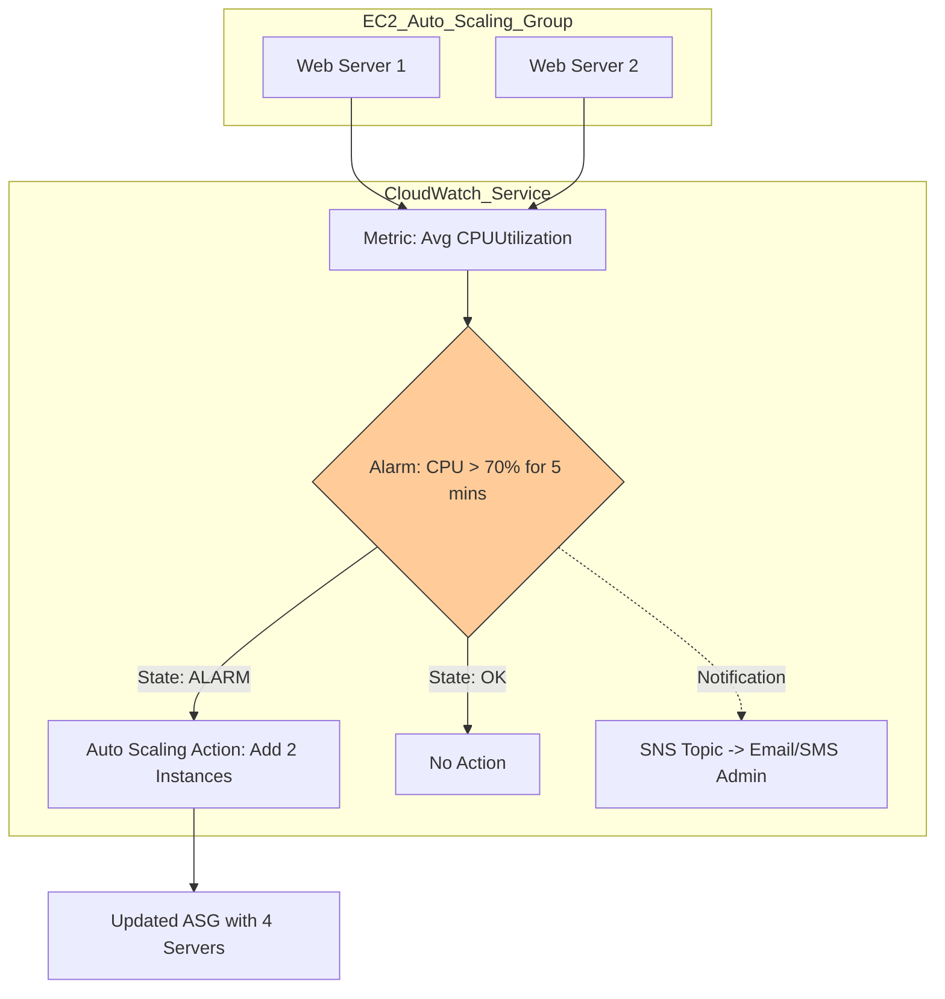

**Text Description for Manual Sketch:**
1.  Draw two EC2 server icons. From them, draw an arrow pointing to a graph icon labeled "Metric: Avg CPU Utilization."
2.  From the graph, draw an arrow to a traffic-light icon labeled "CloudWatch Alarm: CPU > 70%."
3.  From the alarm, draw two outgoing arrows:
    *   One arrow pointing to an email icon labeled "SNS Notification to Admin."
    *   Another arrow pointing to a gear icon labeled "Auto Scaling Action: Launch 2 more servers."

**4. Key Use Cases**
*   **Infrastructure Auto-Healing:** An alarm on `StatusCheckFailed` triggers an EC2 instance recovery action, stopping and restarting the instance automatically.
*   **Proactive Cost Control:** An alarm on the `EstimatedCharges` billing metric sends an email when monthly spend exceeds a budget threshold.
*   **Application Performance Monitoring:** An alarm on `ELB Latency` or `TargetResponseTime` exceeding a service level objective (SLO) triggers a Lambda function to roll back a canary deployment.

**5. Conclusion**
CloudWatch transforms operations from reactive firefighting to proactive automation. By closing the loop from metric monitoring to automated alarm actions, it enables the self-healing, elastic infrastructure that is the hallmark of mature cloud operations.

---

### WILDCARD PREDICTION: Governance, Risk & Compliance (GRC) & Cloud Cube Model (10M)

**Answer:**

**1. Introduction**
Your analysis is spot on. **GRC** and the **Cloud Cube Model** are high-level organizational and assessment frameworks. GRC ensures IT activities align with business objectives and regulations, while the Cloud Cube Model provides a 4-dimensional framework for selecting the right network boundary and service ownership model for cloud deployments. Their cyclical absence makes them prime candidates for a comeback.

**2. Part A: Governance, Risk, and Compliance (GRC)**

*   **Cloud Governance:**
    *   The framework that establishes policies, objectives, and decision-making authority. It answers "How do we ensure we're using the cloud correctly and efficiently?"
    *   **Key Activities:** Resource tagging strategies, budget controls, cost allocation, identity lifecycle management, and architectural standard enforcement.

*   **Cloud Risk Management:**
    *   The process of identifying, assessing, and mitigating risks associated with cloud adoption.
    *   **Key Risks:** Vendor lock-in, data breaches due to misconfiguration, loss of cryptographic keys, supply chain attacks, and concentration risk (single provider failure).
    *   **Mitigation:** Multi-cloud strategies, rigorous IAM key management, and continuous threat modeling.

*   **Cloud Compliance:**
    *   Adhering to external legal, regulatory, and industry standards.
    *   **Key Regulations:** PCI-DSS (payment card data), HIPAA (health data in the US), GDPR (personal data in the EU), SOC 1/2/3 (financial reporting & security controls).
    *   **Shared Responsibility for Compliance:** The cloud provider offers a *certified compliant infrastructure*, but the customer is responsible for configuring their cloud resources in a compliant manner. An audit-ready infrastructure is a shared burden.

**3. Part B: The Jericho Cloud Cube Model**
The Cloud Cube Model is a powerful framework for categorizing cloud networks based on four dimensions, helping organizations select the right architecture.

*   **Dimension 1: Physical Location of Data**
    *   **Internal (On-Premise):** Data is within the organization's own physical boundary.
    *   **External (Outsourced):** Data is in a third-party provider's data center.

*   **Dimension 2: State of Operation (Ownership & Management)**
    *   **Proprietary:** The technology, APIs, and services are owned and tightly controlled by a single vendor. High risk of lock-in.
    *   **Open:** The technology uses open standards, open-source software, and offers high interoperability and portability between providers.

*   **Dimension 3: Network Boundary (Security Perimeter)**
    *   **Perimeterised (Traditional):** The classic "castle-and-moat" security model. Security is enforced by firewalls and NACLs at the network boundary. Resources inside the perimeter are implicitly trusted.
    *   **De-perimeterised (Zero Trust):** The modern model. There is no trusted network boundary. Every access request, whether inside or outside the network, is authenticated, authorized, and encrypted. Security moves to the identity and data layer.

*   **Dimension 4: Insourced vs Outsourced**
    *   **Insourced:** The organization's own IT staff manages and operates the service.
    *   **Outsourced:** A third-party MSP or the cloud provider manages and operates the service.

**4. Mermaid.js Diagram: The 4 Dimensions of the Cloud Cube**
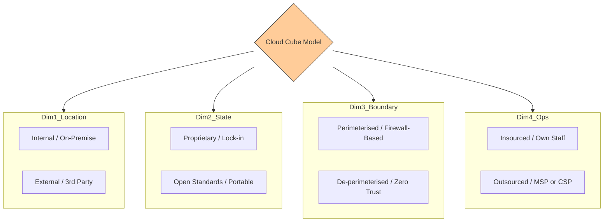

**Text Description for Manual Sketch:**
1.  Draw a 3D cube (or a simple square representing the model).
2.  From each face/side of the square, draw a line to a label for one of the four dimensions.
3.  For each dimension, draw a two-way arrow indicating the spectrum:
    *   "Physical: Internal (On-Prem) <--> External (Cloud)"
    *   "State: Proprietary (Lock-in) <--> Open (Portable)"
    *   "Boundary: Perimeterised (Firewall) <--> De-perimeterised (Zero Trust)"
    *   "Ops: Insourced (Self) <--> Outsourced (Provider)"

**5. Conclusion**
The Cloud Cube Model provides a vocabulary for strategic cloud planning. A modern, best-practice deployment often occupies the quadrant: **External, Open, De-perimeterised, and a hybrid of Insourced/Outsourced**. GRC provides the continuous process framework to ensure that the chosen quadrant remains secure, cost-effective, and legally defensible.

---

This completes the full strategic preparation for your exam. Focus on internalizing the diagrams and the comparison tables, as those are the primary differentiators for a gold medalist answer. Best of luck.