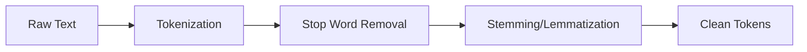
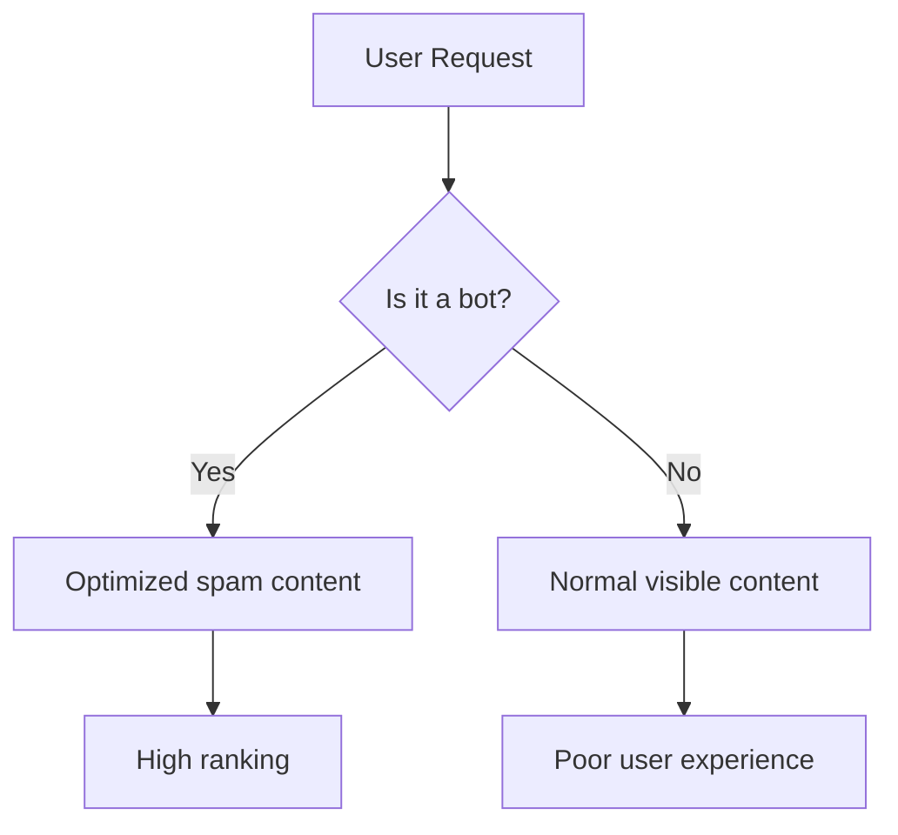
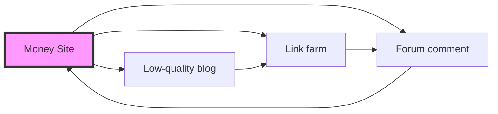
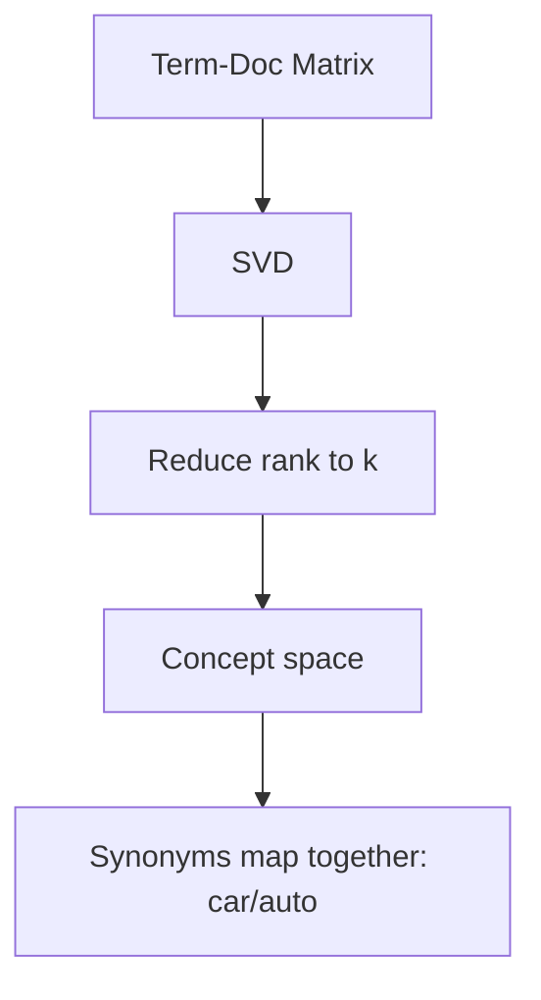
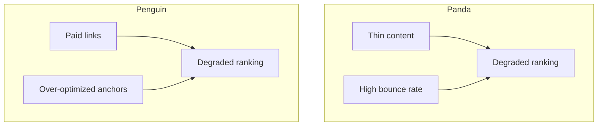
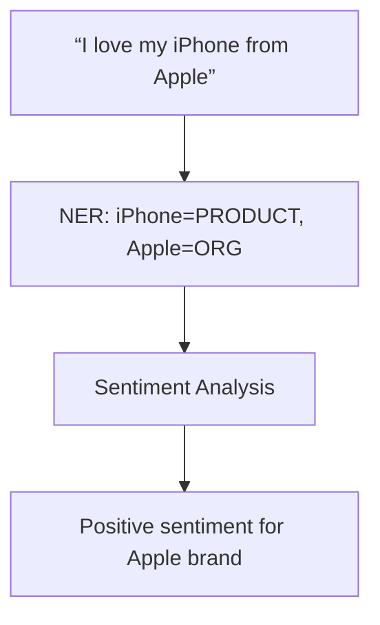

Here are the **high-yield questions** answered in a structured, exam-ready format suitable for a Data Science / Text Mining paper.  
Each answer includes: **Definition**, **Explanation**, **Tabular/Mermaid diagram** where relevant, and **Key takeaways**.

---

# 📘 SET 1 – Almost Certain to Appear

## ✅ Q1. Explain stemming, lemmatization, and stop word removal.

### 📌 Definition
- **Stemming**: Heuristic process that chops off word endings to reduce to a base root form (may not be a real word).
- **Lemmatization**: Morphological analysis that reduces word to its dictionary base form (lemma) using vocabulary and part-of-speech.
- **Stop word removal**: Filtering out common words (e.g., “the”, “is”, “and”) that carry little semantic value.

### 📊 Tabular Comparison

| Feature | Stemming | Lemmatization |
|---------|----------|----------------|
| Output | Root/stem (may be non-dictionary) | Dictionary word (lemma) |
| Approach | Rule-based (e.g., Porter stemmer) | Vocabulary + POS tagging |
| Speed | Fast | Slower |
| Accuracy | Lower (over-stemming/under-stemming) | Higher |
| Example | “studies” → “studi” | “studies” → “study” |

### 🧹 Stop Word Removal
- Improves computational efficiency.
- Removes noise for tasks like **sentiment analysis** and **topic modeling**.
- Example:  
  “The movie is not good” → “movie not good” (keeping “not” is crucial).



### ✅ Exam Tip
In answers, always give **before/after examples** for each technique.

---

## ✅ Q2. Discuss two hiding techniques used by web spammers.

### 📌 Definition
**Web spamming** = manipulating search engine rankings using deceptive methods.  
**Hiding techniques** = making content invisible to users but visible to search engines.

### 🔐 Technique 1: Cloaking
- Serving different content to **search engine bots** vs. **human users**.
- Detected via IP address or user-agent.
- Example: Bot sees “best DSLR reviews”, user sees “click here for casino”.

### 🔐 Technique 2: Hidden Text / Hidden Links
- Text/links same color as background, tiny font, or positioned off-screen (CSS).
- Keyword stuffing hidden from users.
- Example: White text on white background: “Viagra, Viagra, Viagra...”



### ✅ Difference Table

| Technique | Method | Detection |
|-----------|--------|------------|
| Cloaking | Different content per user-agent | IP inspection, fetch comparison |
| Hidden text | CSS positioning, font color=background | Visual rendering check |

---

## ✅ Q3. What is link spamming? Describe common techniques.

### 📌 Definition
**Link spamming** = artificially creating or manipulating hyperlinks to inflate a page’s PageRank or authority.

### 🧩 Common Techniques

| Technique | Description |
|-----------|-------------|
| Link farms | Group of pages interlinking with each other |
| Private blog networks (PBNs) | Owned sites linking to money site |
| Guest post spam | Low-quality guest blogs with backlinks |
| Wiki/comment spam | Adding links in user-generated content |
| Three-way linking | A→B, B→C, C→A (harder to detect) |



### 🛡️ Countermeasures
- Google Penguin penalty
- Disavow tool
- Link quality scoring (TrustRank)

---

## ✅ Q4. Explain Latent Semantic Indexing (LSI) and inverted index.

### 📌 Definitions
- **Inverted Index**: Mapping from terms → list of documents containing them (like book index).
- **Latent Semantic Indexing (LSI)** : Dimensionality reduction technique using SVD to capture hidden semantic relationships between terms and docs.

### 🔍 Inverted Index Example

| Term | Doc IDs |
|------|---------|
| data | D1, D3 |
| mining | D1, D2 |
| text | D2, D3 |

### 🧠 LSI Steps

1. Build term-document matrix
2. Apply **SVD**: \( A = U \Sigma V^T \)
3. Reduce dimensions (keep top k singular values)
4. Similarity in reduced space captures **latent concepts**



### ✅ Benefits of LSI
- Handles synonymy (car ↔ auto)
- Handles polysemy (bank: river/finance) – partially
- Improves retrieval accuracy

---

## ✅ Q5. Explain web spamming and how Google Panda/Penguin control it.

### 📌 Definition
**Web spam** = any deliberate action to unfairly manipulate search engine rankings.

### 🐼 Google Panda (2011)
- Targets **content quality**.
- Penalizes:
  - Thin content
  - Duplicate content
  - Keyword stuffing
  - Low user engagement

### 🐧 Google Penguin (2012)
- Targets **link quality**.
- Penalizes:
  - Unnatural backlinks
  - Link farms
  - Exact-match anchor text over-optimization



### ✅ Outcome
Both algorithms run periodically, not real-time.  
Recovery requires **manual reconsideration request** after fixing issues.

---

# 📘 SET 2 – High Probability

## ✅ Q6. Differentiate supervised vs unsupervised sentiment classification.

| Aspect | Supervised | Unsupervised |
|--------|------------|---------------|
| Training data | Labeled (pos/neg/neu) | Unlabeled |
| Approach | Classifiers: NB, SVM, LSTM | Lexicon-based (e.g., SentiWordNet) |
| Accuracy | High (80–95%) | Moderate (60–75%) |
| Domain dependency | Requires retraining per domain | Portable lexicon |
| Example | Movie review labeled dataset | Count positive/negative words |

```mermaid
graph LR
A[Supervised] --> A1[Labeled tweets]
A1 --> A2[Train classifier]
A2 --> A3[Predict]

B[Unsupervised] --> B1[Word lexicon pos/neg]
B1 --> B2[Score = sum(weights)]
B2 --> B3[Classify by threshold]
```

---

## ✅ Q7. Explain Named Entity Recognition (NER) with use case.

### 📌 Definition
**NER** = subtask of information extraction that locates and classifies named entities (person, org, location, date, etc.) in text.

### 🧩 Example
Text: “Elon Musk founded SpaceX in Hawthorne, California on March 14, 2002.”  
NER output:

| Entity | Type |
|--------|------|
| Elon Musk | PERSON |
| SpaceX | ORG |
| Hawthorne | LOC |
| California | LOC |
| March 14, 2002 | DATE |

### ✅ Use Case – Social Media Mining
Detect **entity-specific sentiment**:  
“Apple released new iPhone” → extract **Apple (ORG)** → monitor brand perception.



---

## ✅ Q8. Describe opinion spam detection for abnormal behavior detection.

### 📌 Definition
**Opinion spam** = fake reviews written to promote/demote products (e.g., Amazon fake reviews).

### 🔍 Abnormal behavior indicators

| Type | Indicator |
|------|------------|
| Text-based | Too many superlatives, repeated phrases |
| Time-based | Multiple reviews same IP, same minute |
| Graph-based | Reviewer network (same reviewers for competing products) |
| Rating deviation | 5-star + 1-star only, no moderate ratings |

### 🛠️ Detection methods
- **Supervised learning**: features = review length, POS patterns, sentiment intensity
- **Unsupervised**: clustering reviewers by behavioral fingerprint
- **Network analysis**: bipartite reviewer-product graph → detect collusion

---

## ✅ Q9. Explain any one recommendation algorithm with social context.

### 📌 Algorithm: Social Collaborative Filtering (SocialCF)

**Core idea**:  
Traditional CF: predict rating =  
\[
\hat{r}_{ui} = \bar{r}_u + \frac{\sum_{v \in N(u)} sim(u,v) (r_{vi} - \bar{r}_v)}{\sum |sim|}
\]

**SocialCF** adds:  
\[
\hat{r}_{ui} = \alpha \times CF_{rating} + (1-\alpha) \times Social_{influence}
\]  
where \( Social_{influence} = \frac{1}{|F(u)|} \sum_{f \in friends} r_{fi} \)

### ✅ Social context benefits
- Solves **cold start** (new user has social graph but no ratings)
- Trust-aware filtering
- Homophily-based recommendations

```mermaid
graph LR
U[User u] --> S[Social friends]
U --> R[Ratings]
S --> F[Friends’ ratings]
R --> CF[CF prediction]
F --> SCF[Social prediction]
CF --> Merge[α + (1-α)]
SCF --> Merge
Merge --> Final[Final recommendation]
```

---

## ✅ Q10. What is probabilistic document clustering?

### 📌 Definition
Probabilistic clustering assumes documents are generated from a **mixture of probability distributions** (usually multinomial for text).

### 🧠 Model – Mixture of Multinomials (Naïve Bayes clustering)

\[
P(d_i | \theta) = \sum_{j=1}^k P(c_j) \prod_{t=1}^m P(w_t | c_j)^{n_{it}}
\]

- Each cluster \( c_j \) is a multinomial word distribution.
- EM algorithm estimates:
  - Cluster priors \( P(c_j) \)
  - Word probabilities \( P(w_t | c_j) \)

### 📊 vs K-Means

| Aspect | K-Means | Probabilistic |
|--------|---------|----------------|
| Distance metric | Euclidean/Cosine | Likelihood |
| Output | Hard assignment | Soft assignment (posterior prob) |
| Assumption | Spherical clusters | Generative model |

✅ Advantages: Handles uncertainty, interpretable as topic model (simpler than LDA).

---

# 📐 Final Summary Table for Quick Revision

| Question | Core Concept | Diagram Needed? | Marks Prediction |
|----------|--------------|----------------|------------------|
| Q1 | Stemming/Lemmatization/Stop words | Yes (flow) | 5–7 |
| Q2 | Hiding techniques (cloaking, hidden text) | No | 5 |
| Q3 | Link spamming | Yes (link farm) | 5 |
| Q4 | LSI + Inverted Index | Yes (SVD flow) | 10 |
| Q5 | Panda / Penguin | Yes (comparison) | 5–7 |
| Q6 | Sentiment supervised vs unsupervised | No | 5 |
| Q7 | NER + use case | Yes (example) | 5 |
| Q8 | Opinion spam detection | No | 5 |
| Q9 | Social recommendation | Yes (formula + flow) | 5–7 |
| Q10 | Probabilistic clustering | No | 4–5 |

---

