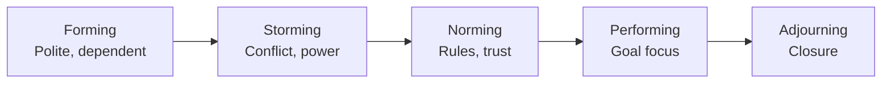
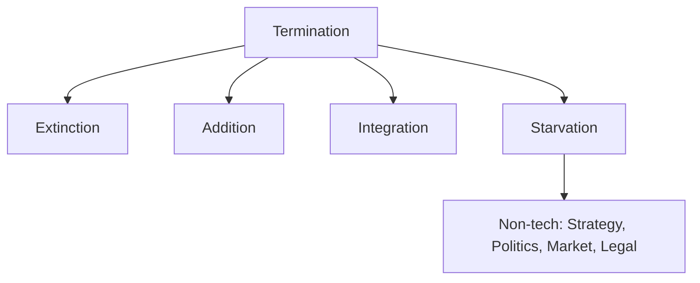
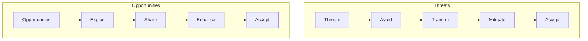
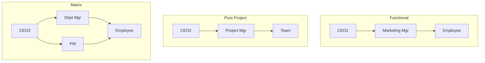
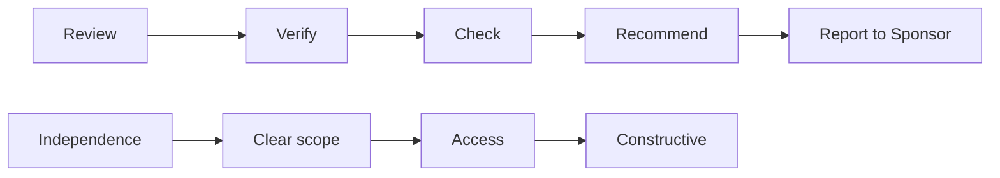
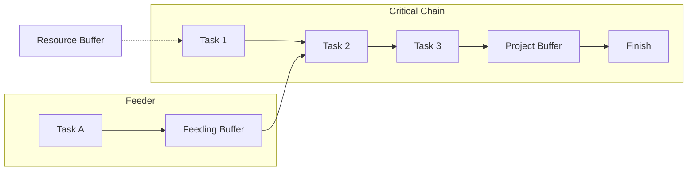

Absolutely. Here is the **enhanced version** of the Tier 1 & Tier 2 answers, keeping the **expanded 10-mark format**, **diagrams**, and now with **mnemonics embedded** for each topic so you can recall them instantly in the exam.

---

# 🎯 TIER 1 – BIG 6 (10-Mark Answers with Mnemonics)

## 1. Four stages of team development and growth (Tuckman)

**🧠 Mnemonic:** **F**or **S**ome **N**ice **P**erformance (Forming, Storming, Norming, Performing)  
**Bonus for 5th stage:** **A**fter **P**erforming, **A**djourn (Adjourning)

**Definition (1 mark):**  
A model describing how a team evolves from strangers to a high-performing unit through predictable stages.

**Detailed Answer (9 marks – 8-10 points):**

| Stage | Key Characteristics | PM Action Required |
|-------|---------------------|---------------------|
| **1. Forming** | – Polite, anxious, dependent<br>– Unclear goals<br>– Individual roles undefined | – Provide clear direction<br>– Introduce team members<br>– Set initial ground rules |
| **2. Storming** | – Conflict over leadership<br>– Clashing personalities<br>– Subgroups form | – Facilitate conflict resolution<br>– Reinforce common goals<br>– Don't suppress – manage |
| **3. Norming** | – Rules and values emerge<br>– Trust builds<br>– Collaboration begins | – Step back gradually<br>– Encourage autonomy<br>– Celebrate small wins |
| **4. Performing** | – Focused on project goals<br>– Flexible and adaptive<br>– Minimal supervision needed | – Delegate authority<br>– Remove external obstacles |
| **5. Adjourning** (optional) | – Team disbands<br>– Closure and recognition needed | – Conduct lessons learned<br>– Celebrate achievements |

**Text Diagram:**
```
Forming → Storming → Norming → Performing → (Adjourning)
(Anxiety)  (Conflict) (Cohesion) (Results)    (Closure)
```

**Mermaid Diagram:**


**Exam Tip:** Draw the performance dip during Storming, then rise through Norming to Performing.

---

## 2. Ways a project may be terminated + non-technical reasons

**🧠 Mnemonic for termination types:** **E**very **A**lien **I**s **S**cary (Extinction, Addition, Integration, Starvation)  
**🧠 Mnemonic for non-tech reasons:** **S**ome **P**eople **M**ake **L**egal **R**ules (Strategy, Politics, Market, Legal, Regulatory)

**Definition (1 mark):**  
Termination is formal end of project work. Non-technical reasons exclude technology failure.

**4 Termination Ways (4 marks – 1 each):**

| Type | Description | Example | Resource handling |
|------|-------------|---------|--------------------|
| **Extinction** | Natural completion – success or failure | Product launched, team disbanded | Gradual release |
| **Addition** | Project becomes ongoing operation | IT project becomes helpdesk | Permanent reassignment |
| **Integration** | Resources absorbed into other projects | R&D team split into two new projects | Distributed |
| **Starvation** | Slow budget cutting – "death by thousand cuts" | Monthly budget reduced until zero | Demoralized attrition |

**Non-technical reasons (4 marks – 4 of these):**

| Reason | Example |
|--------|---------|
| **Strategy change** | Company pivots, project no longer aligns |
| **Politics** | Internal rivalry kills support |
| **Market disappearance** | Competitor launched similar product |
| **Legal/Regulatory** | New law makes project illegal |
| **Sponsor loss** | Champion leaves or loses power |
| **Resource reallocation** | Higher priority project emerges |

**Text Diagram:**
```
Project Termination
├── Extinction (complete)
├── Addition (becomes ops)
├── Integration (absorbed)
└── Starvation (slow death) ←─ Non-tech reasons: Strategy, Politics, Market, Legal
```

**Mermaid:**


**Exam Tip:** Starvation is most common exam trap – it's NOT poor performance, it's political/funding.

---

## 3. Probability-impact matrix + risk response strategies

**🧠 Mnemonic for threats:** **A**ll **T**igers **M**ight **A**ttack (Avoid, Transfer, Mitigate, Accept)  
**🧠 Mnemonic for opportunities:** **E**very **S**hark **E**ats **A**nything (Exploit, Share, Enhance, Accept)

**Definition (1 mark):**  
A qualitative risk analysis tool mapping probability vs impact to prioritize responses.

**Part A: Probability-Impact Matrix (3 marks)**
```
                IMPACT
            Low     Med     High
         ┌──────┬───────┬───────┐
Prob  High│ Med  │ High  │CRITICAL│
         ├──────┼───────┼───────┤
      Med│ Low  │ Med   │ High   │
         ├──────┼───────┼───────┤
      Low│ Low  │ Low   │ Med    │
         └──────┴───────┴───────┘
```

**Part B: Threat Responses (3 marks)**

| Response | Action | Example |
|----------|--------|---------|
| **Avoid** | Eliminate cause | Change scope to remove risky feature |
| **Transfer** | Shift impact | Insurance, fixed-price contract |
| **Mitigate** | Reduce probability/impact | Add testing, use proven tech |
| **Accept** | Acknowledge & budget | Contingency reserve |

**Part C: Opportunity Responses (3 marks)**

| Response | Action | Example |
|----------|--------|---------|
| **Exploit** | Make it happen | Add resources to finish early |
| **Share** | Partner to capture | Joint venture |
| **Enhance** | Increase probability | Upskill team |
| **Accept** | Take if occurs | No proactive action |

**Mermaid:**


**Exam Tip:** Draw the 3×3 grid first on rough sheet. Accept appears in both.

---

## 4. Differentiate between Functional, Pure Project, and Matrix organizations

**🧠 Mnemonic:** **F**unctional = **F**unctional boss; **P**roject = **P**roject boss; **M**atrix = **M**ixed boss (dual reporting)

**Definition (1 mark):**  
Organizational structures defining project authority, resource control, and reporting lines.

**Comparison Table (7 marks – 7 differences):**

| Factor | Functional | Pure Project | Matrix |
|--------|------------|--------------|--------|
| **PM authority** | None / very low | High – full control | Low to high (weak/balanced/strong) |
| **Resource control** | Functional manager | Project manager | Shared (dual) |
| **Team loyalty** | Functional dept | Project only | Split (both) |
| **Communication** | Vertical silos | Horizontal | Both |
| **Response time** | Slow | Fast | Medium |
| **Cost efficiency** | High (no duplication) | Low | Medium |
| **Best for** | Routine projects | Large, unique projects | Cross-functional |

**Matrix subtypes (2 marks):**
- **Weak Matrix:** Functional manager dominates
- **Balanced Matrix:** Shared authority
- **Strong Matrix:** PM dominates (near pure project)

**Text Diagram:**
```
Functional:     CEO → Dept Mgr → Employee (no PM)
Pure Project:   CEO → PM → Team (full PM power)
Matrix:         CEO → Dept Mgr ←→ PM → Employee (dual reporting)
```

**Mermaid:**


**Exam Tip:** Always mention dual reporting as Matrix's defining pain point.

---

## 5. Responsibilities of project auditor + what makes a successful audit

**🧠 Mnemonic for responsibilities:** **R**eal **V**ery **C**ool **R**eports **R**equired (Review, Verify, Check, Recommend, Report)  
**🧠 Mnemonic for success factors:** **I** **C**an **A**sk **C**learly (Independence, Clear scope, Access, Constructive)

**Definition (1 mark):**  
Independent reviewer assessing project health, compliance, and processes – not individual performance.

**5 Responsibilities (5 marks – R.V.C.R.R.):**

| Responsibility | Detailed Action |
|----------------|-----------------|
| **Review** | Examine plans, schedules, budgets, risk registers |
| **Verify** | Compare actual vs planned (cost, schedule, scope) |
| **Check** | Assess compliance with standards, policies, regulations |
| **Recommend** | Propose corrective actions, process improvements |
| **Report** | Deliver findings to sponsor/steering committee (NOT to PM) |

**Success factors (4 marks – I.C.A.C.):**

| Factor | Why it matters |
|--------|----------------|
| **Independence** | No reporting line to PM – avoids bias |
| **Clear scope** | Audit charter defines boundaries upfront |
| **Access** | Unrestricted documents, interviews, data |
| **Constructive** | Focus on fixing processes, not blaming people |
| **Action taken** | Recommendations implemented (bonus factor) |

**Text Diagram:**
```
Audit Process: Input → Review → Verify → Check → Recommend → Report → Action
                     (R)      (V)      (C)       (R)        (R)
```

**Mermaid:**


**Exam Tip:** Never say auditor reports to PM – that's a trap. Sponsor/steering committee only.

---

## 6. Goldratt's Critical Chain Method (CCM)

**🧠 Mnemonic:** **P**lease **F**eed **R**abbits – **P**roject buffer, **F**eeding buffer, **R**esource buffer + **N**o multitasking

**Definition (1 mark):**  
A scheduling method considering both task dependencies AND resource constraints, adding buffers to protect project completion.

**5 Key Components (5 marks):**

| Component | Explanation |
|-----------|-------------|
| **Critical Chain** | Longest path considering resource dependencies (not just logical like CPM) |
| **Project Buffer** | Time added at end – protects due date |
| **Feeding Buffers** | Where non-critical chains join critical chain – prevents delays spreading |
| **Resource Buffers** | Alerts that critical resource will be needed soon (warning, not time) |
| **No multitasking** | Focus on one task until done – eliminates context switching loss |

**Additional concepts (3 marks):**
- **Student syndrome** – people start late; CCM removes safety time from tasks
- **Parkinson's Law** – work expands to fill time; CCM uses aggressive estimates + central buffers
- **Drum-Buffer-Rope** – Drum = critical chain pace; Buffer = protection; Rope = release timing

**Text Diagram:**
```
Non-Critical A ---[Feeding Buffer]---+
Non-Critical B ---[Feeding Buffer]---+
                                     v
Critical Chain → T1 → T2 → T3 → [Project Buffer] → Finish
                  ↑
             [Resource Buffer: "Engineer needed"]
```

**Mermaid:**


**Exam Tip:** Key difference from CPM: CPM ignores resources; CCM includes them.

---

# 🎯 TIER 2 – STRONG 7 (10-Mark Answers with Mnemonics)

## 7. Work Breakdown Structure (WBS)

**🧠 Mnemonic for WBS rules:** **1**00% **M**utually **E**xclusive **D**eliverables **S**ized right (100% rule, Mutually exclusive, Deliverable-oriented, Sized 8-80 hours)

**Definition (1 mark):**  
Deliverable-oriented hierarchical decomposition of total project scope into manageable work packages.

**5 Key Rules (5 marks):**

| Rule | Explanation |
|------|-------------|
| **100% Rule** | Sum of children = parent level. No missing or extra work. |
| **Mutually exclusive** | No overlap between work packages. |
| **Work package size** | 8–80 hours rule (or 1–2 weeks) – manageable. |
| **Deliverable-oriented** | Nouns, not verbs (e.g., "Foundation" not "Pour concrete") |
| **Progressive elaboration** | WBS evolves as scope clarifies. |

**WBS Levels Example (2 marks):**
```
Level 1: House Construction
Level 2: Foundation, Structure, Roof, Finishing
Level 3: Foundation → Excavation, Rebar, Pour concrete
Level 4: Pour concrete → Order concrete, Setup forms, Pour, Cure
```

**Benefits (2 marks):**
- Basis for estimating cost, time, resources
- Assigns accountability
- Prevents scope creep
- Enables earned value management

**Text Diagram:**
```
House (L1)
├── 1.0 Foundation (L2)
│   ├── 1.1 Excavation (L3)
│   └── 1.2 Rebar (L3)
└── 2.0 Structure (L2)
```

**Exam Tip:** Draw a 3-level WBS for any example (house, software, event).

---

## 8. Purchasing cycle

**🧠 Mnemonic:** **N**ew **S**uppliers **N**ever **O**ffer **R**eally **P**oor **C**offee (Need, Select, Negotiate, Order, Receive, Pay, Close)

**Definition (1 mark):**  
End-to-end process of acquiring goods/services from external suppliers.

**7 Stages (7 marks – 1 each):**

| Stage | Activities | Document |
|-------|------------|----------|
| **1. Need** | Requisition raised, specs defined | Purchase Requisition |
| **2. Select** | RFQ/RFP, evaluate bids | RFQ, Bid tabulation |
| **3. Negotiate** | Price, terms, delivery, quality | Negotiation notes |
| **4. Order** | Formal purchase order issued | Purchase Order (PO) |
| **5. Receive** | Goods received, checked vs PO | Receiving report |
| **6. Pay** | 3-way match (PO, receipt, invoice) | Invoice, voucher |
| **7. Close** | Contract closure, feedback | Close-out report |

**3-Way Match (2 marks):** PO + Receiving Report + Invoice must align before payment.

**Text Diagram:**
```
Need → Select → Negotiate → Order → Receive → Pay → Close
 PR     RFQ      Terms      PO      Receipt   3-way   Archive
```

**Exam Tip:** Don't forget expediting – following up on late orders.

---

## 9. Communication planning and management

**🧠 Mnemonic:** **W**ho **W**hat **H**ow **W**hen **W**hom (5 Ws of communication planning)

**Definition (1 mark):**  
Determining stakeholder information needs, methods, frequency, and responsibility.

**5 Ws of Communication Plan (5 marks):**

| Element | Question |
|---------|----------|
| **Who** | Stakeholder / group |
| **What** | Type of information (status, risk, decision) |
| **How** | Channel (email, meeting, dashboard) |
| **When** | Frequency (daily, weekly, milestone) |
| **Whom** | Responsible sender |

**Key concepts (4 marks):**
- **Communication channels:** n(n-1)/2 – as team grows, channels explode
- **Receiver responsibility:** Acknowledgment + confirmation of understanding
- **Noise:** Any barrier (language, culture, distance)
- **Feedback loop:** Confirmation message understood

**Text Diagram:**
```
Sender → Encode → Channel → Decode → Receiver
           ↑                  ↓
         Noise ←──────────── Feedback
```

**Exam Tip:** Projects spend 90% of time communicating. Mention push vs pull communication.

---

## 10. Project charter – contents, who prepares & authorizes

**🧠 Mnemonic for contents:** **P**eter **O**ften **M**akes **B**ig **K**ites **S**elling **A**t **M**arkets – Purpose, Objectives, Milestones, Budget, Key deliverables, Scope, Assumptions, PM, Sponsor signature, Stakeholders (first letters)

**Definition (1 mark):**  
Document that formally authorizes project and gives PM authority to apply resources.

**Contents (6 marks – 6 of these):**

| Content | Details |
|---------|---------|
| Purpose | Business case, problem/opportunity |
| Objectives | SMART goals, KPIs, success criteria |
| High-level scope | Boundaries – what's in/out |
| Key deliverables | Major products/outputs |
| Milestone schedule | Key dates (not detailed) |
| Budget summary | Rough order of magnitude |
| Key stakeholders | Sponsor, PM, customer, team |
| Assigned PM | Name and authority level |
| Sponsor signature | Approves and funds |
| Assumptions/Constraints | Known limits |

**Who prepares & authorizes (2 marks):**
- **Prepares:** Project Manager (or initiator/PMO)
- **Authorizes:** Project Sponsor (or steering committee)

**Text Diagram:**
```
Business Case → Charter (PM) → Review → Sign (Sponsor) → PM gets authority → Planning
```

**Exam Tip:** PM prepares but does NOT authorize. Sponsor authorizes.

---

## 11. Top-down vs bottom-up budgeting

**🧠 Mnemonic:** **T**op-down = **T**otal first; **B**ottom-up = **B**uild from tasks

**Definition (1 mark):**  
Budgeting approaches – top-down (executive driven) vs bottom-up (team driven).

**Comparison Table (8 marks – 8 differences):**

| Factor | Top-down | Bottom-up |
|--------|----------|-----------|
| **Start** | Senior management sets total | Task-level estimates rolled up |
| **Speed** | Fast (hours) | Slow (days/weeks) |
| **Accuracy** | Rough, padded | High (if tasks known) |
| **Buy-in** | Low – imposed | High – ownership |
| **Risk** | May be unrealistic | May exceed funds |
| **Best for** | Early phases | Execution phase |
| **Detail** | Broad categories | Work package level |
| **Bias** | Political negotiation | Padding by team |

**Reconciliation (1 mark):** Top-down sets target; bottom-up provides estimate; negotiate gap.

**Text Diagram:**
```
Top-down:     CEO sets $100k → Allocate to tasks
Bottom-up:    Task A $10k + Task B $20k = $45k → Present
Reconciled:   Target $50k vs Estimate $45k → Final $47k
```

**Exam Tip:** Never say one is "always better" – exam wants iterative reconciliation.

---

## 12. Contract + types of contracts

**🧠 Mnemonic for contract types:** **F**ixed **C**ost **T**ransfers **C**ost – FP (buyer safe), CR (seller safe), T&M (middle)

**Definition (1 mark):**  
Legally binding agreement between buyer and seller specifying deliverables, price, terms.

**Contract types with risk allocation (6 marks):**

| Contract | Buyer risk | Seller risk | When to use |
|----------|------------|-------------|--------------|
| **Fixed Price (FP)** | Low | High | Scope well defined |
| **FP Incentive Fee** | Low-Med | Medium | Cost savings shared |
| **Cost Plus Fixed Fee** | High | Low | R&D, uncertain scope |
| **Cost Plus Incentive** | Medium | Medium | Shared risk/reward |
| **Time & Materials** | Medium | Medium | Staff augmentation |

**Contract elements (2 marks):** Offer, acceptance, consideration, scope, price, payment terms, termination clauses.

**Text Diagram:**
```
Contract Types
├── Fixed Price (buyer safe)
├── Cost Reimbursable (seller safe)
└── Time & Materials (hybrid)
```

**Exam Tip:** FP = buyer happy (low risk); CR = seller happy (low risk).

---

## 13. Significance of IRR method

**🧠 Mnemonic:** **I** **R**eally **R**ank **P**rojects (IRR = Internal Rate of Return, used to Rank Projects by percentage return)

**Definition (1 mark):**  
Discount rate that makes NPV = 0. Measures project profitability as a percentage.

**5 Points of Significance (5 marks):**

| Significance | Explanation |
|--------------|-------------|
| **Profitability %** | Easy to compare with cost of capital |
| **Hurdle rate** | IRR > required return → accept |
| **Time value of money** | Discounts future cash flows |
| **Intuitive for mgmt** | Managers think in percentages |
| **Capital rationing** | Rank projects by highest IRR |

**Limitations (3 marks):**
- **Multiple IRRs** – Non-conventional cash flows give multiple solutions
- **Reinvestment assumption** – Assumes reinvestment at IRR (unrealistic)
- **Scale ignored** – Small project with 100% IRR may be worse than large project with 20% IRR

**Comparison with NPV (1 mark):** NPV theoretically superior (no reinvestment assumption). Use IRR as supplement.

**Text Diagram:**
```
Cash flows: -100, +60, +60
NPV = -100 + 60/(1+r) + 60/(1+r)^2 = 0 → IRR = 13.1%
Decision: If cost of capital = 10% → 13.1% > 10% → Accept
```

**Exam Tip:** Always mention – IRR ignores project size. Use NPV for absolute value.

---

# ✅ Final Exam Cheat Sheet (Draw on Rough Sheet First)

| Topic | Mnemonic | Keywords |
|-------|----------|----------|
| Team stages | For Some Nice Performance | Forming, Storming, Norming, Performing |
| Termination | Every Alien Is Scary | Extinction, Addition, Integration, Starvation |
| Threats | All Tigers Might Attack | Avoid, Transfer, Mitigate, Accept |
| Opportunities | Every Shark Eats Anything | Exploit, Share, Enhance, Accept |
| Auditor | Real Very Cool Reports Required | Review, Verify, Check, Recommend, Report |
| Auditor success | I Can Ask Clearly | Independence, Clear scope, Access, Constructive |
| Goldratt | Please Feed Rabbits + No multitasking | Project, Feeding, Resource buffers |
| WBS | 100% Mutually Exclusive Deliverables Sized | 100% rule, Mutual exclusivity, Deliverable-oriented |
| Purchasing | New Suppliers Never Offer Really Poor Coffee | Need, Select, Negotiate, Order, Receive, Pay, Close |
| Comm plan | Who What How When Whom | Stakeholder, Info, Channel, Frequency, Sender |
| Charter | Peter Often Makes Big Kites Selling At Markets | Purpose, Objectives, Milestones, Budget, etc. |
| Budget | Top total, Bottom build | Top-down (fast, rough), Bottom-up (slow, accurate) |
| Contracts | Fixed Cost Transfers Cost | FP (buyer safe), CR (seller safe), T&M (hybrid) |
| IRR | I Really Rank Projects | Percentage return, compare to cost of capital |

---

**You now have:**
- 10-mark expanded answers
- Text + Mermaid diagrams
- Mnemonics for every topic

**Go write each twice. Good luck.** 🚀